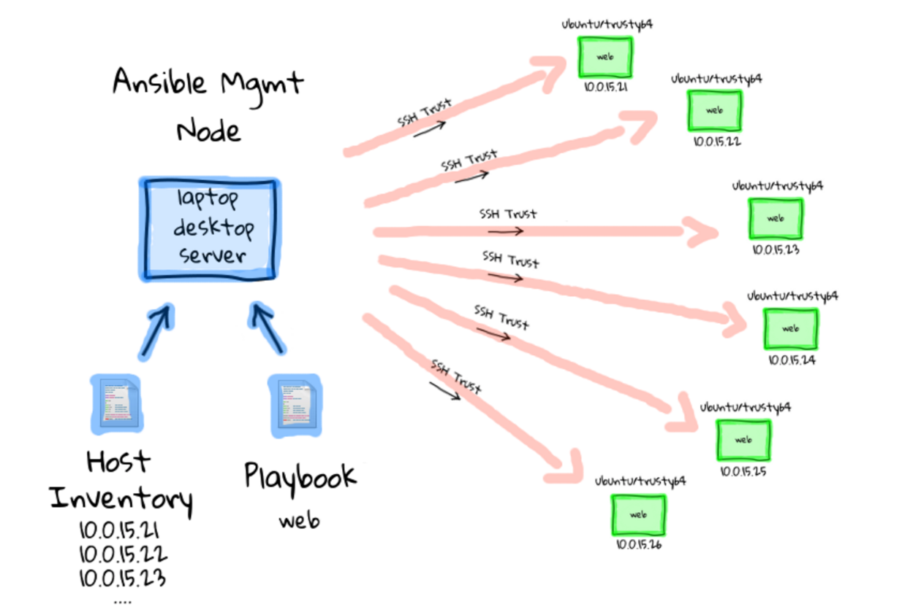
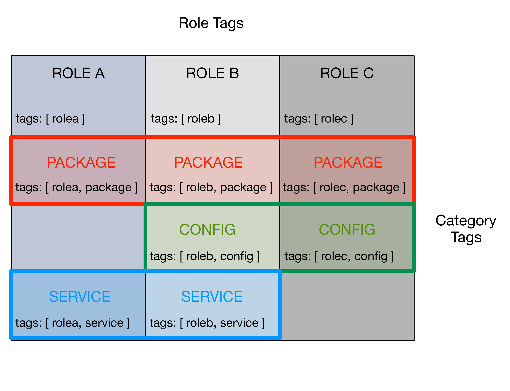

.. _ansibleintro:

Ansible and Configuration Management
====================================

`Ansible`_ is an open source tool that can be used to automate system
administration tasks related to installation, configuration, account setup, and
anything else required to manage system configurations across a large number of
computers.

While it is possible to manually install and configure a hand-full of
computer systems that do not change very often, this kind of system
deployment and system administration quickly becomes a limiting factor. It
does not scale very well, for one, and makes it very difficult to change
or replicate. You may need to move hardware from one data center to another,
requiring reconfiguration of both hosts and dozens of VM guests. You may
need to move from one Linux distribution to another. You may wish to add
another continuous integration build cluster to support another operating
system major/minor version, or a new processor architecture like ARM.
Even if the number of hosts is small, having the knowledge of how the
systems were built and configured in the head of just one person (who
may go on vacation, or permanently leave the project) increases the
risk of total disruption of the project in the event of an outage.

.. tip::

   If you are not familiar with Ansible, take some time to look at
   the Ansible `Get Started`_ page, and/or watch the following
   video series. While they are a little dated now (2015, pre-
   Ansible 2.x), they cover many useful concepts.

       + `19 Minutes With Ansible (Part 1/4)`_, Justin Weissig, sysadmincasts.com, January 13, 2015
       + `Learning Ansible with Vagrant (Part 2/4)`_, Justin Weissig, sysadmincasts.com, March 19, 2015
       + `Configuration Management with Ansible (Part 3/4)`_, Justin Weissig, sysadmincasts.com, March 26, 2015
       + `Zero-downtime Deployment with Ansible (Part 4/4)`_, Justin Weissig, sysadmincasts.com, April 2, 2015

   Also highly recommended is to immediately get and read all of Jeff
   Geerling's book, `Ansible for DevOps`_. This book is more up-to-date in
   terms of covering Ansible 2.x features and coding style. It will save you
   countless hours of floundering around and Jeff's Ansible coding style is top
   quality.

   Many more references can be found in Section :ref:`bestpractices` (originally
   collected at <https://staff.washington.edu/dittrich/home/unix.html#ansible>).

..

.. _Get Started: https://www.ansible.com/get-started
.. _19 Minutes With Ansible (Part 1/4): https://sysadmincasts.com/episodes/43-19-minutes-with-ansible-part-1-4
.. _Learning Ansible with Vagrant (Part 2/4): https://sysadmincasts.com/episodes/45-learning-ansible-with-vagrant-part-2-4
.. _Configuration Management with Ansible (Part 3/4): https://sysadmincasts.com/episodes/46-configuration-management-with-ansible-part-3-4
.. _Zero-downtime Deployment with Ansible (Part 4/4): https://sysadmincasts.com/episodes/47-zero-downtime-deployments-with-ansible-part-4-4
.. _Ansible section: https://staff.washington.edu/dittrich/home/unix.html#ansible

.. _ansiblefundamentals:

Ansible fundamentals
--------------------

Ansible allows you to document all of the steps necessary to perform the
required tasks, organize sets of computers on which those steps should
be performed, and then allow you to perform those tasks precisely and
consistently across all of those hosts.  Figure :ref:`ansibleOverview`
(source: `19 Minutes with Ansible (Part 1/4)`_ ) illustrates this process.

.. _ansibleOverview:

    Ansible Overview

..

At the center of the left side of Figure :ref:`ansibleOverview` is the
**Ansible Management Node** (also called by some a **Control** node). This
figure depicts the *push model* for using Ansible, where a Control machine
holds the playbooks and inventory files necessary to drive Ansible, and that
Control machine reaches out to *target* hosts on which the actions take place.
Another way to use Ansible is by using a ``localhost`` connection for the
Control machine to also be the Target machine (in which case the actions
Ansible performs are done to the same computer on which Ansible is running.)

A set of hosts can be specified with an *inventory*. Ansible supports two
styles for static inventories, an INI format style, and a YAML format style.
The INI style format is known as a ``hosts`` file, by default stored in a file
named ``/etc/ansible/hosts``.

An INI style inventory that implements the example above could look like this:

.. code-block:: yaml

    [web]
    10.0.15.21
    10.0.15.22
    10.0.15.23
    10.0.15.24
    10.0.15.25
    10.0.15.26

..

.. note::

    The ``-i`` flag can be used to specify the inventory file to use,
    rather than always having to over-write the file ``/etc/ansible/hosts``.
    Alternatively, it can be specified in an ``ansible.cfg`` file,
    typically found in ``/etc/ansible/ansible.cfg`` for the global
    file. This is covered more in Section :ref:`ansibleconfiguration`.)

..

Ansible has two main command line interface programs you can use. The
first is just ``ansible`` and it allows you to run individual modules
against a set of hosts (also known as "running a play"). Here is a
very simple example of running the ``ping`` module against every
host in the ``all`` group in the ``development`` inventory shown
above:

.. code-block:: none

    $ ansible -i $GIT/ansible-playbooks/inventory/development all -m ping
    floyd2-p.devops.develop | success >> {
        "changed": false,
        "ping": "pong"
    }

    hub.devops.develop | success >> {
        "changed": false,
        "ping": "pong"
    }

    u12-dev-svr-1.devops.develop | success >> {
        "changed": false,
        "ping": "pong"
    }

    linda-vm1.devops.develop | success >> {
        "changed": false,
        "ping": "pong"
    }

    u12-dev-ws-1.devops.develop | success >> {
        "changed": false,
        "ping": "pong"
    }

..

Using the ``command`` module, and passing in arguments, you can run arbitrary
commands on hosts as a form of distributed SSH:

.. code-block:: none

    $ ansible -i $GIT/ansible-playbooks/inventory/development all -m command -a /usr/bin/uptime
    floyd2-p.devops.develop | success | rc=0 >>
     01:02:52 up 22 days,  7:27,  1 user,  load average: 0.04, 0.12, 1.11

    u12-dev-ws-1.devops.develop | success | rc=0 >>
     01:02:52 up 148 days, 14:58,  1 user,  load average: 0.00, 0.01, 0.05

    u12-dev-svr-1.devops.develop | success | rc=0 >>
     01:02:45 up 144 days, 17:53,  1 user,  load average: 0.03, 0.05, 0.05

    hub.devops.develop | success | rc=0 >>
     09:02:52 up 130 days, 15:14,  1 user,  load average: 0.00, 0.01, 0.05

    linda-vm1.devops.develop | success | rc=0 >>
     01:02:53 up 148 days, 14:58,  1 user,  load average: 0.00, 0.01, 0.05

..

The other principal command line program is ``ansible-playbook``, which is used
to run more complex playbooks made up of multiple sequentially organized plays
with all kinds of complex logic and other organizational techniques to manage
complex processes.  Examples of writing and running playbooks are found in the
rest of this document.

.. note::

   Ansible also has a Python API that can be used to embed Ansible
   functionality into other programs, or to write your own modules to perform
   tasks.  This is explained in the video `Alejandro Guirao Rodríguez -
   Extending and embedding Ansible with Python`_ from EuroPython 2015.

..

.. caution::

   Always remember that Ansible is used in a distributed system manner,
   meaning that it has two execution contexts:

   (1) it runs with the chosen Python interpreter on the **control** host,
   which creates Python code that is then

   (2) copied to and executed within the context of the **target** host.

   Take another look at Figure :ref:`ansibleOverview` and realize that the
   arrows pointing away from the blue node (the control host) to the many green
   nodes (the targets) implicitly show this context switch.

   This has ramifications for targets that run operating systems like CoreOS
   (that don't have Python installed, and don't have a package manager), and
   for use of modules like ``apt`` that call Python libraries to use operating
   system specific package managers like APT from within Ansible's Python code.

   Since the DIMS project uses Python virtual environments to isolate
   the Python interpreter used by developers from the interpreter used
   by the system (to avoid breaking the system), this means by definition
   there are multiple Python interpreters on DIMS hosts. This requires
   that pay **very close attention** to configuration settings that affect
   the Python interpreter used by Ansible and consciously do things (and
   test the results of changes carefully to know when a change breaks
   something in Ansible.) The result of changes the Python interpreter used by
   Ansible can be random failures with cryptic error messages like these:

   .. code-block:: none

       Traceback (most recent call last):
         File \"/home/core/.ansible/tmp/ansible-tmp-1462413293.33-173671562381843/file\", line 114, in <module>
           exitcode = invoke_module(module, zipped_mod, ZIPLOADER_PARAMS)
         File \"/home/core/.ansible/tmp/ansible-tmp-1462413293.33-173671562381843/file\", line 28, in invoke_module
           p = subprocess.Popen(['/opt/bin/python', module], env=os.environ, shell=False, stdout=subprocess.PIPE, stderr=subprocess.PIPE, stdin=subprocess.PIPE)
         File \"/usr/lib/python2.7/subprocess.py\", line 710, in __init__
           errread, errwrite)
         File \"/usr/lib/python2.7/subprocess.py\", line 1335, in _execute_child
           raise child_exception
       OSError: [Errno 2] No such file or directory

   ..

   .. code-block:: none

       msg: Could not import python modules: apt, apt_pkg. Please install python-apt package.

   ..

   Both of these messages are due to the Python interpreter being used by Ansible
   on the **target** end being set to a non-system Python interpreter that does
   not have the necessary libraries or programs that Ansible needs. In the
   second case, commenters on blogs may say, "But I installed ``python-apt``
   and I still get this message. Why?" Yes, you may have installed the
   ``python-apt`` package like it says, but it was installed into the
   **system** Python interpreter, which is **not** the one that Ansible is
   using if ``ansible_python_interpreter`` or ``$PATH`` would cause Ansible to
   use a different one!

..

.. _ansibleVariables:

Variables
---------

.. note::

    As of the release of this repository, the DIMS project has adopted Ansible 2.x
    and switched to using the little-documented (but much more powerful) YAML style
    inventory. This will be described in more detail elsewhere.

..

.. TODO(dittrich): Put in a link to where YAML inventory is described.

Ansible playbooks are general rules and steps for performing actions.
These actions can be selected using logic ("If this is Redhat, do ``A``, but if
it is Ubuntu, do ``B``"), or by using `Jinja templating`_ to apply variables to
a generic template file, resulting in specific contents customized for a given host.

.. _Jinja templating: http://jinja.pocoo.org

Some of these variables (known as "facts") are set by Ansible when it first
starts to run on a target host, while others are defined in files that
accompany playbooks and inventories.  You can see the dictionary of
``ansible_facts`` for a given system using Ansible's ``setup`` module:

.. code-block:: none

    $ ansible -m setup localhost -c local
    localhost | success >> {
        "ansible_facts": {
            "ansible_all_ipv4_addresses": [
                "172.17.0.1",
                "10.88.88.5",
                "192.168.0.100",
                "10.86.86.7"
            ],
            "ansible_all_ipv6_addresses": [
                "fe80::d253:49ff:fed7:9ebd"
            ],
            "ansible_architecture": "x86_64",
            "ansible_bios_date": "01/29/2015",
            "ansible_bios_version": "A13",
            "ansible_cmdline": {
                "BOOT_IMAGE": "/vmlinuz-3.16.0-30-generic",
                "quiet": true,
                "ro": true,
                "root": "/dev/mapper/hostname_vg-root_lv",
                "splash": true,
                "vt.handoff": "7"
            },
            "ansible_date_time": {
                "date": "2016-03-10",
                "day": "10",
                "epoch": "1457653607",
                "hour": "15",
                "iso8601": "2016-03-10T23:46:47Z",
                "iso8601_micro": "2016-03-10T23:46:47.246903Z",
                "minute": "46",
                "month": "03",
                "second": "47",
                "time": "15:46:47",
                "tz": "PST",
                "tz_offset": "-0800",
                "weekday": "Thursday",
                "year": "2016"
            },
            "ansible_default_ipv4": {
                "address": "192.168.0.100",
                "alias": "wlan0",
                "gateway": "192.168.0.1",
                "interface": "wlan0",
                "macaddress": "d0:53:49:d7:9e:bd",
                "mtu": 1500,
                "netmask": "255.255.255.0",
                "network": "192.168.0.0",
                "type": "ether"
            },
            "ansible_default_ipv6": {},
            "ansible_devices": {
                "sda": {
                    "holders": [],
                    "host": "SATA controller: Intel Corporation 8 Series...",
                    "model": "ST1000LM014-1EJ1",
                    "partitions": {
                        "sda1": {
                            "sectors": "997376",
                            "sectorsize": 512,
                            "size": "487.00 MB",
                            "start": "2048"
                        },
                        "sda2": {
                            "sectors": "2",
                            "sectorsize": 512,
                            "size": "1.00 KB",
                            "start": "1001470"
                        },
                        "sda5": {
                            "sectors": "1952522240",
                            "sectorsize": 512,
                            "size": "931.04 GB",
                            "start": "1001472"
                        }
                    },
                    "removable": "0",
                    "rotational": "1",
                    "scheduler_mode": "deadline",
                    "sectors": "1953525168",
                    "sectorsize": "4096",
                    "size": "7.28 TB",
                    "support_discard": "0",
                    "vendor": "ATA"
                },
                "sr0": {
                    "holders": [],
                    "host": "SATA controller: Intel Corporation 8 Series...",
                    "model": "DVD-ROM SU-108GB",
                    "partitions": {},
                    "removable": "1",
                    "rotational": "1",
                    "scheduler_mode": "deadline",
                    "sectors": "2097151",
                    "sectorsize": "512",
                    "size": "1024.00 MB",
                    "support_discard": "0",
                    "vendor": "TSSTcorp"
                }
            },
            "ansible_distribution": "Ubuntu",
            "ansible_distribution_major_version": "14",
            "ansible_distribution_release": "trusty",
            "ansible_distribution_version": "14.04",
            "ansible_docker0": {
                "active": false,
                "device": "docker0",
                "id": "8000.0242a37d17a7",
                "interfaces": [],
                "ipv4": {
                    "address": "172.17.0.1",
                    "netmask": "255.255.0.0",
                    "network": "172.17.0.0"
                },
                "macaddress": "02:42:a3:7d:17:a7",
                "mtu": 1500,
                "promisc": false,
                "stp": false,
                "type": "bridge"
            },
            "ansible_domain": "",
            "ansible_env": {
                "BASE": "bash",
                "BYOBU_ACCENT": "#75507B",
                "BYOBU_BACKEND": "tmux",
                "BYOBU_CHARMAP": "UTF-8",
                "BYOBU_CONFIG_DIR": "/home/dittrich/.byobu",
                "BYOBU_DARK": "#333333",
                "BYOBU_DATE": "%Y-%m-%d ",
                "BYOBU_DISTRO": "Ubuntu",
                "BYOBU_HIGHLIGHT": "#DD4814",
                "BYOBU_LIGHT": "#EEEEEE",
                "BYOBU_PAGER": "sensible-pager",
                "BYOBU_PREFIX": "/usr",
                "BYOBU_PYTHON": "python3",
                "BYOBU_READLINK": "readlink",
                "BYOBU_RUN_DIR": "/dev/shm/byobu-dittrich-0R38I1Mb",
                "BYOBU_SED": "sed",
                "BYOBU_TIME": "%H:%M:%S",
                "BYOBU_TTY": "/dev/pts/24",
                "BYOBU_ULIMIT": "ulimit",
                "BYOBU_WINDOW_NAME": "-",
                "CFG": "/opt/dims/nas/scd",
                "CLUTTER_IM_MODULE": "xim",
                "COLORTERM": "gnome-terminal",
                "COMMAND": "",
                "COMPIZ_BIN_PATH": "/usr/bin/",
                "COMPIZ_CONFIG_PROFILE": "ubuntu",
                "CONSUL_LEADER": "10.142.29.116",
                "DBUS_SESSION_BUS_ADDRESS": "unix:abstract=/tmp/dbus-sYbG5zmdUA",
                "DEBUG": "0",
                "DEFAULTS_PATH": "/usr/share/gconf/ubuntu.default.path",
                "DESKTOP_SESSION": "ubuntu",
                "DIMS": "/opt/dims",
                "DIMS_REV": "unspecified",
                "DIMS_VERSION": "1.6.129 (dims-ci-utils)",
                "DISPLAY": ":0",
                "GDMSESSION": "ubuntu",
                "GDM_LANG": "en_US",
                "GIT": "/home/dittrich/dims/git",
                "GNOME_DESKTOP_SESSION_ID": "this-is-deprecated",
                "GNOME_KEYRING_CONTROL": "/run/user/1004/keyring-7kI0rA",
                "GNOME_KEYRING_PID": "2524",
                "GPG_AGENT_INFO": "/run/user/1004/keyring-7kI0rA/gpg:0:1",
                "GTK_IM_MODULE": "ibus",
                "GTK_MODULES": "overlay-scrollbar:unity-gtk-module",
                "HOME": "/home/dittrich",
                "IM_CONFIG_PHASE": "1",
                "INSTANCE": "",
                "JOB": "dbus",
                "LANG": "C",
                "LANGUAGE": "en_US",
                "LC_CTYPE": "C",
                "LESSCLOSE": "/usr/bin/lesspipe %s %s",
                "LESSOPEN": "| /usr/bin/lesspipe %s",
                "LOGNAME": "dittrich",
                "LS_COLORS": "rs=0:di=01;34:ln=01;36:mh=00:pi=40;33:a....",
                "MANDATORY_PATH": "/usr/share/gconf/ubuntu.mandatory.path",
                "NAS": "/opt/dims/nas",
                "OLDPWD": "/home/dittrich",
                "OS": "Linux",
                "PATH": "/home/dittrich/dims/envs/dimsenv/bin:/home/di...",
                "PROGRAM": "/bin/bash",
                "PROJECT_HOME": "/home/dittrich/dims/devel",
                "PS1": "\\[\\033[1;34m\\][dimsenv]\\[\\e[0m\\] \\[\\03...",
                "PWD": "/vm/vagrant-run-devserver",
                "QT4_IM_MODULE": "xim",
                "QT_IM_MODULE": "ibus",
                "QT_QPA_PLATFORMTHEME": "appmenu-qt5",
                "RECIPIENTS": "dims-devops@uw.ops-trust.net",
                "SELINUX_INIT": "YES",
                "SESSION": "ubuntu",
                "SESSIONTYPE": "gnome-session",
                "SESSION_MANAGER": "local/dimsdemo1:@/tmp/.ICE-unix/27...",
                "SHELL": "/bin/bash",
                "SHLVL": "3",
                "SSH_AUTH_SOCK": "/home/dittrich/.byobu/.ssh-agent",
                "STAT": "stat",
                "TERM": "screen-256color",
                "TEXTDOMAIN": "im-config",
                "TEXTDOMAINDIR": "/usr/share/locale/",
                "TMUX": "/tmp/tmux-1004/default,3276,1",
                "TMUX_PANE": "%16",
                "UPSTART_SESSION": "unix:abstract=/com/ubuntu/upstart-s...",
                "USER": "dittrich",
                "VERBOSE": "0",
                "VIRTUALENVWRAPPER_HOOK_DIR": "/home/dittrich/dims/envs",
                "VIRTUALENVWRAPPER_PROJECT_FILENAME": ".project",
                "VIRTUALENVWRAPPER_PYTHON": "/home/dittrich/dims/bin/python",
                "VIRTUALENVWRAPPER_SCRIPT": "/home/dittrich/dims/bin/vir...",
                "VIRTUALENVWRAPPER_WORKON_CD": "1",
                "VIRTUAL_ENV": "/home/dittrich/dims/envs/dimsenv",
                "VTE_VERSION": "3409",
                "WINDOWID": "23068683",
                "WORKON_HOME": "/home/dittrich/dims/envs",
                "XAUTHORITY": "/home/dittrich/.Xauthority",
                "XDG_CONFIG_DIRS": "/etc/xdg/xdg-ubuntu:/usr/share/upstar...",
                "XDG_CURRENT_DESKTOP": "Unity",
                "XDG_DATA_DIRS": "/usr/share/ubuntu:/usr/share/gnome:/usr...",
                "XDG_GREETER_DATA_DIR": "/var/lib/lightdm-data/dittrich",
                "XDG_MENU_PREFIX": "gnome-",
                "XDG_RUNTIME_DIR": "/run/user/1004",
                "XDG_SEAT": "seat0",
                "XDG_SEAT_PATH": "/org/freedesktop/DisplayManager/Seat0",
                "XDG_SESSION_ID": "c2",
                "XDG_SESSION_PATH": "/org/freedesktop/DisplayManager/Session0",
                "XDG_VTNR": "7",
                "XMODIFIERS": "@im=ibus",
                "_": "/home/dittrich/dims/envs/dimsenv/bin/ansible"
            },
            "ansible_eth0": {
                "active": false,
                "device": "eth0",
                "macaddress": "34:e6:d7:72:0d:b0",
                "module": "e1000e",
                "mtu": 1500,
                "promisc": false,
                "type": "ether"
            },
            "ansible_form_factor": "Laptop",
            "ansible_fqdn": "dimsdemo1",
            "ansible_hostname": "dimsdemo1",
            "ansible_interfaces": [
                "docker0",
                "tun88",
                "lo",
                "tun0",
                "wlan0",
                "vboxnet2",
                "vboxnet0",
                "vboxnet1",
                "eth0"
            ],
            "ansible_kernel": "3.16.0-30-generic",
            "ansible_lo": {
                "active": true,
                "device": "lo",
                "ipv4": {
                    "address": "127.0.0.1",
                    "netmask": "255.0.0.0",
                    "network": "127.0.0.0"
                },
                "ipv6": [
                    {
                        "address": "::1",
                        "prefix": "128",
                        "scope": "host"
                    }
                ],
                "mtu": 65536,
                "promisc": false,
                "type": "loopback"
            },
            "ansible_lsb": {
                "codename": "trusty",
                "description": "Ubuntu 14.04.3 LTS",
                "id": "Ubuntu",
                "major_release": "14",
                "release": "14.04"
            },
            "ansible_machine": "x86_64",
            "ansible_memfree_mb": 2261,
            "ansible_memtotal_mb": 15988,
            "ansible_mounts": [
                {
                    "device": "/dev/mapper/hostname_vg-root_lv",
                    "fstype": "ext4",
                    "mount": "/",
                    "options": "rw,errors=remount-ro",
                    "size_available": 859396513792,
                    "size_total": 982859030528
                },
                {
                    "device": "/dev/sda1",
                    "fstype": "ext3",
                    "mount": "/boot",
                    "options": "rw",
                    "size_available": 419035136,
                    "size_total": 486123520
                }
            ],
            "ansible_nodename": "dimsdemo1",
            "ansible_os_family": "Debian",
            "ansible_pkg_mgr": "apt",
            "ansible_processor": [
                "Intel(R) Core(TM) i7-4710MQ CPU @ 2.50GHz",
                "Intel(R) Core(TM) i7-4710MQ CPU @ 2.50GHz",
                "Intel(R) Core(TM) i7-4710MQ CPU @ 2.50GHz",
                "Intel(R) Core(TM) i7-4710MQ CPU @ 2.50GHz",
                "Intel(R) Core(TM) i7-4710MQ CPU @ 2.50GHz",
                "Intel(R) Core(TM) i7-4710MQ CPU @ 2.50GHz",
                "Intel(R) Core(TM) i7-4710MQ CPU @ 2.50GHz",
                "Intel(R) Core(TM) i7-4710MQ CPU @ 2.50GHz"
            ],
            "ansible_processor_cores": 4,
            "ansible_processor_count": 1,
            "ansible_processor_threads_per_core": 2,
            "ansible_processor_vcpus": 8,
            "ansible_product_name": "Precision M4800",
            "ansible_product_serial": "NA",
            "ansible_product_uuid": "NA",
            "ansible_product_version": "01",
            "ansible_python_version": "2.7.6",
            "ansible_selinux": false,
            "ansible_ssh_host_key_dsa_public": "AAAA...==",
            "ansible_ssh_host_key_ecdsa_public": "AA...==",
            "ansible_ssh_host_key_rsa_public": "AAAA...",
            "ansible_swapfree_mb": 975,
            "ansible_swaptotal_mb": 975,
            "ansible_system": "Linux",
            "ansible_system_vendor": "Dell Inc.",
            "ansible_tun0": {
                "active": true,
                "device": "tun0",
                "ipv4": {
                    "address": "10.86.86.7",
                    "netmask": "255.255.255.0",
                    "network": "10.86.86.0"
                },
                "mtu": 1500,
                "promisc": false
            },
            "ansible_tun88": {
                "active": true,
                "device": "tun88",
                "ipv4": {
                    "address": "10.88.88.5",
                    "netmask": "255.255.255.0",
                    "network": "10.88.88.0"
                },
                "mtu": 1500,
                "promisc": false
            },
            "ansible_user_id": "dittrich",
            "ansible_userspace_architecture": "x86_64",
            "ansible_userspace_bits": "64",
            "ansible_vboxnet0": {
                "active": false,
                "device": "vboxnet0",
                "macaddress": "0a:00:27:00:00:00",
                "mtu": 1500,
                "promisc": false,
                "type": "ether"
            },
            "ansible_vboxnet1": {
                "active": false,
                "device": "vboxnet1",
                "macaddress": "0a:00:27:00:00:01",
                "mtu": 1500,
                "promisc": false,
                "type": "ether"
            },
            "ansible_vboxnet2": {
                "active": false,
                "device": "vboxnet2",
                "macaddress": "0a:00:27:00:00:02",
                "mtu": 1500,
                "promisc": false,
                "type": "ether"
            },
            "ansible_virtualization_role": "host",
            "ansible_virtualization_type": "kvm",
            "ansible_wlan0": {
                "active": true,
                "device": "wlan0",
                "ipv4": {
                    "address": "192.168.0.100",
                    "netmask": "255.255.255.0",
                    "network": "192.168.0.0"
                },
                "ipv6": [
                    {
                        "address": "fe80::d253:49ff:fed7:9ebd",
                        "prefix": "64",
                        "scope": "link"
                    }
                ],
                "macaddress": "d0:53:49:d7:9e:bd",
                "module": "wl",
                "mtu": 1500,
                "promisc": false,
                "type": "ether"
            },
            "module_setup": true
        },
        "changed": false
    }

..

Other variables are added from variables files found in ``defaults/`` and
``vars/`` directories in a role, from ``group_vars/``, from ``host_vars/``,
from ``vars`` listed in a playbook, and from the command line with the ``-e``
flag.

You can run playbooks using the ``ansible-playbook`` command directly,
by using a DIMS wrapper script (``dims.ansible-playbook``) which allows
you to run playbooks, tasks, or roles by name, or via the
``dimscli`` Python CLI program.

.. caution::

   As a general rule, interrupting ``ansible-playbook`` with CTRL-C in the
   middle of a playbook run is a Bad Idea. The reason for this is that
   some playbooks will disable a service temporarily and notify a handler
   to restart the service at the end of the playbook run, or may successfully
   change only some configuration files (leaving the ones that would have
   been changed had the CTRL-C not been issued), either of which can leave
   the system in an inconsistent and/or potentially inoperable state.

   It is best to test playbooks on Vagrant hosts that are not critical if
   they are accidentally rendered inoperable rather than getting into an
   emergency debugging situation with a "production" server. If testing
   with a "live" system, having an active SSH terminal session as a
   fallback for local access helps, but not always. Be aware of this
   risk and act accordingly!

..

.. _ansibleconfiguration:

Configuration and Customization of ``ansible`` and ``ansible-playbook``
-----------------------------------------------------------------------

Like any good Unix program, you can use a global or local `Configuration
file` to customize default settings and/or program behavior. Ansible
provides the following alternatives:

* ``ANSIBLE_CONFIG`` (an environment variable)
* ``ansible.cfg`` (in the current directory)
* ``.ansible.cfg`` (in the home directory)
* ``/etc/ansible/ansible.cfg``

.. _Configuration file: http://docs.ansible.com/ansible/intro_configuration.html

There are many reasons why this configuration customization is useful. The
following subsections describe some.

.. caution::

   Keep in mind that one or more of these configuration files may exist on a
   host causing Ansible to potentially behave differently than expected between
   different accounts, different systems, etc. If something appears to not
   work the way you expected, look for these files and see how they are set,
   add extra levels of verbosity with additional ``-v`` flags, or otherwise
   check how Ansible is being configured to work within scripts that
   run ``ansible`` or ``ansible-playbook``.

   To determine which one of these files might be used in a given working
   directory, you can use the following loop to show which file or files
   may exist:

   .. code-block:: none

      $ pwd
      /home/dittrich/dims/git/ansible-playbooks
      $ for f in $ANSIBLE_CONFIG ansible.cfg ~/.ansible.cfg /etc/ansible/ansible.cfg; \
      do [ -f $f ] && echo $f exists; done
      /etc/ansible/ansible.cfg exists

      $ cp /etc/ansible.cfg myconfig.cfg
      $ vi myconfig.cfg
        [ ... ]
      $ ANSIBLE_CONFIG=myconfig.cfg
      $ for f in $ANSIBLE_CONFIG ansible.cfg ~/.ansible.cfg /etc/ansible/ansible.cfg; \
      do [ -f $f ] && echo $f exists; done
      myconfig.cfg exists
      /etc/ansible/ansible.cfg exists

   ..

..

Controlling account, SSH port, etc.
~~~~~~~~~~~~~~~~~~~~~~~~~~~~~~~~~~~

There are several parameters that affect SSH connections and
the number of simultaneous forked connections useful for accelerating
parallel execution of Ansible tasks across a hosts in an
inventory.  In the example here, we set the number of forks
to ``10``, the default sudo user to ``root``, the default
SSH port to ``8422`` and the transport mechanism to ``smart``:

.. code-block:: none
   :emphasize-lines: 18,20,23,24

    # config file for ansible -- http://ansible.com/
    # ==============================================

    # nearly all parameters can be overridden in ansible-playbook
    # or with command line flags. ansible will read ANSIBLE_CONFIG,
    # ansible.cfg in the current working directory, .ansible.cfg in
    # the home directory or /etc/ansible/ansible.cfg, whichever it
    # finds first

    [defaults]

    # some basic default values...

    #hostfile       = /etc/ansible/hosts
    #library        = /usr/share/ansible
    #remote_tmp     = $HOME/.ansible/tmp
    #pattern        = *
    forks          = 10
    #poll_interval  = 15
    sudo_user      = root
    #ask_sudo_pass = True
    #ask_pass      = True
    transport      = smart
    remote_port    = 8422
    module_lang    = C
     . . .

..

.. _fedoraproject:

Lessons from the Fedora Project Ansible Playbooks
-------------------------------------------------

One of the better models identified during the second year
of the DIMS Project was the Fedora Project's public
`ansible.git repo`_. The layout of their repo is described
in a `README`_ file.

The Fedora Project puts very little in individual `host_vars files`_
to store minimal host-specific settings for use in playbooks.
This will be examined here in the context of generating ``iptables`` rules
files from Jinja templates.

.. note::

   You can view all of the files in sequence using a Bash ``for`` loop,
   as follows:

   .. code-block:: bash

      $ cd ~/git/fedora-ansible/
      $ for f in inventory/host_vars/*
      > do
      > echo $f
      > echo "===================="
      > cat $f
      > echo "===================="
      > echo ""
      > done | less

   ..

   The output looks like this:

   .. code-block:: none

      inventory/host_vars/aarch64-02a.arm.fedoraproject.org
      ====================
      fas_client_groups: sysadmin-noc,sysadmin-releng

      kojipkgs_url: armpkgs.fedoraproject.org
      kojihub_url: arm.koji.fedoraproject.org/kojihub
      kojihub_scheme: https
      eth0_ip: 10.5.78.75
      gw: 10.5.78.254

      koji_server_url: "http://arm.koji.fedoraproject.org/kojihub"
      koji_weburl: "http://arm.koji.fedoraproject.org/koji"
      koji_topurl: "http://armpkgs.fedoraproject.org/"

      nfs_mount_opts: rw,hard,bg,intr,noatime,nodev,nosuid,nfsvers=3,rsize=32768,wsize=32768

      fedmsg_certs:
      - service: releng
        owner: root
        group: sysadmin-releng
        can_send:
        # pungi-koji stuff (ask dgilmore)
        - pungi.compose.phase.start
        - pungi.compose.phase.stop
        - pungi.compose.status.change
        - pungi.compose.createiso.targets
        - pungi.compose.createiso.imagefail
        - pungi.compose.createiso.imagedone

      ====================

      inventory/host_vars/aarch64-03a.arm.fedoraproject.org
      ====================
      ---
      eth0_ip: 10.5.78.80
      ====================

      inventory/host_vars/aarch64-04a.arm.fedoraproject.org
      ====================
      ---
      eth0_ip: 10.5.78.85
      ====================

      ...

    ..

..

Let's look at the file `noc01.phx2.fedoraproject.org`_, specifically
the blocks at lines 12-18.

.. note::

    The ``custom_rules`` array in this example was split into separate lines
    here for better readability, as is found in other files such as
    `db-fas01.phx2.fedoraproject.org`_. It is a single line in the original
    file (which is perfectly acceptable, though more difficult to read
    in a limited-column environment such as this documenation. The desire here
    was to show a file with all three of ``tcp_ports``, ``udp_ports``, and
    ``custom_rules`` variables, hence the cosmetic alteration.

..

.. code-block:: yaml
   :linenos:
   :emphasize-lines: 12-18

    ---
    nm: 255.255.255.0
    gw: 10.5.126.254
    dns: 10.5.126.21

    ks_url: http://10.5.126.23/repo/rhel/ks/kvm-rhel-7
    ks_repo: http://10.5.126.23/repo/rhel/RHEL7-x86_64/
    volgroup: /dev/vg_virthost
    vmhost: virthost17.phx2.fedoraproject.org
    datacenter: phx2

    tcp_ports: ['22', '80', '443', '67', '68']
    udp_ports: ['67','68','69']
    custom_rules: [
        '-A INPUT -p tcp -m tcp -s 192.168.1.20 --dport 5666 -j ACCEPT',
        '-A INPUT -p tcp -m tcp -s 10.5.126.13 --dport 873 -j ACCEPT',
        '-A INPUT -p tcp -m tcp -s 192.168.1.59 --dport 873 -j ACCEPT'
    ]

    eth0_ip: 10.5.126.41
    csi_relationship: |
        noc01 is the internal monitoring nagios instance to the phx datacenter.
        it is also the dhcp server serving all computing nodes

        * This host relies on:
        - the virthost it's hosted on (virthost17.phx2.fedoraproject.org)
        - FAS to authenticate users
        - VPN connectivity

        * Things that rely on this host:
        - Infrastructure team to be awair of the infra status. operations control process will fail
        - if this host is down, it will be difficult to know the status of infra and provide reactive/proactive support
        - if this host is down, dhcp/bootp leases/renew will fail. pxe booting will fail as well

..

.. _generating_iptables:

Generating ``iptables`` Rules from a Template
---------------------------------------------

.. note::

    Ansible suggests that Jinja templates use the extension ``.j2``, though
    Ansible will process the template regardless of whether it has an extension
    or not. The example ``iptables`` template used by the Fedora Project has
    no ``.j2`` extension, while the DIMS project uses the ``.j2`` extension
    to more easily locate Jinja template files using ``find . -name '*.j2'``
    or similar extension-based searching methods.

..

The template `roles/base/templates/iptables/iptables`_ (processed by
`roles/base/tasks/main.yml`_ as part of the `base
role`) provides a Jinja template for an ``iptables`` rule set.

.. note::

    The complete template file `roles/base/templates/iptables/iptables`_
    is over 100 lines. It is edited here to remove lines that are irrelevant
    to the discussion of Jinja templating.

..

.. Using "guess" successfully gets Jinja template syntax highlighting from Sphinx.

.. code-block:: guess
   :caption: Template for iptables rules
   :emphasize-lines: 56-61, 63-68, 70-75

    # {{ ansible_managed }}
    *filter
    :INPUT ACCEPT [0:0]
    :FORWARD ACCEPT [0:0]
    :OUTPUT ACCEPT [0:0]

    # allow ping and traceroute
    -A INPUT -p icmp -j ACCEPT

    # localhost is fine
    -A INPUT -i lo -j ACCEPT

    # Established connections allowed
    -A INPUT -m state --state RELATED,ESTABLISHED -j ACCEPT
    -A OUTPUT -m state --state RELATED,ESTABLISHED -j ACCEPT

    # allow ssh - always
    -A INPUT -m conntrack --ctstate NEW -m tcp -p tcp --dport 22 -j ACCEPT

    
    #
    # In the phx2 datacenter, both production and staging hosts are in the same
    # subnet/vlan. We want production hosts to reject connectons from staging group hosts
    # to prevent them from interfering with production. There are however a few hosts in
    # production we have marked 'staging-friendly' that we do allow staging to talk to for
    # mostly read-only data they need.
    #
    
    # {{ host }}
    -A INPUT -s {{ hostvars[host]['eth0_ip'] }} -j REJECT --reject-with icmp-host-prohibited
    # {{ host }} has no 'eth0_ip' listed
    
    
    

    
    #
    # In the qa.fedoraproject.org network, we want machines not in the qa-isolated group
    # to block all access from that group. This is to protect them from any possible attack
    # vectors from qa-isolated machines.
    #
    
    # {{ host }}
    -A INPUT -s {{ hostvars[host]['eth0_ip'] }} -j REJECT --reject-with icmp-host-prohibited
    # {{ host }} has no 'eth0_ip' listed
    
    
    
    # if the host declares a fedmsg-enabled wsgi app, open ports for it
    
    
    -A INPUT -p tcp -m tcp --dport 30{{ '%02d' % i }} -j ACCEPT
    
    

    # if the host/group defines incoming tcp_ports - allow them
    
    
    -A INPUT -p tcp -m tcp --dport {{ port }} -j ACCEPT
    
    

    # if the host/group defines incoming udp_ports - allow them
    
    
    -A INPUT -p udp -m udp --dport {{ port }} -j ACCEPT
    
    

    # if there are custom rules - put them in as-is
    
    
    {{ rule }}
    
    

    # otherwise kick everything out
    -A INPUT -j REJECT --reject-with icmp-host-prohibited
    -A FORWARD -j REJECT --reject-with icmp-host-prohibited
    COMMIT

..

.. _configcustomization:

Customization of System and Service Configuration
-------------------------------------------------

Ansible supports variables in playbooks, allowing a generalization of
steps to perform some task to be defined separate from the specifics
of the content used. Rather than hard-coding a value like a port number
into a command, a variable can be used to allow *any* port to be specified
at run time. Where and how the variable is set is somewhat complicated
in Ansible, as their are many places that variables can be set and
a specific order of precedence that is followed. This can be seen
in the Ansible documentation, `Variable Precedence: Where Should I Put A Variable?`_.

.. _Variable Precedence\: Where Should I Put A Variable?: http://docs.ansible.com/ansible/playbooks_variables.html#variable-precedence-where-should-i-put-a-variable

The Fedora Project takes advantage of an advanced feature of Ansible
in the form of the conditional ``with_first_found`` combined with
the use of variables and variable precedence ordering.  Ansible's
own web page has a note saying, "This is an advanced topic that is
infrequently used. You can probably skip this section."

(See `Selecting Files And Templates Based On Variables`_).

.. _Selecting Files And Templates Based On Variables: http://docs.ansible.com/ansible/playbooks_conditionals.html#selecting-files-and-templates-based-on-variables

An example of how this is used is found in `roles/base/tasks/main.yml`_
where the DNS resolver configuration file is applied:

.. _roles/base/tasks/main.yml: https://infrastructure.fedoraproject.org/cgit/ansible.git/plain/roles/base/tasks/main.yml

.. code-block:: yaml
   :caption: Configuration file for DNS resolver
   :emphasize-lines: 3-8

    - name: /etc/resolv.conf
      copy: src={{ item }} dest=/etc/resolv.conf
      with_first_found:
        - "{{ resolvconf }}"
        - resolv.conf/{{ ansible_fqdn }}
        - resolv.conf/{{ host_group }}
        - resolv.conf/{{ datacenter }}
        - resolv.conf/resolv.conf
      tags: [ base, config, resolvconf ]

..

The first thing to notice is that the base name of file being
installed here (``resolv.conf``) is used to name a directory
in which all variations of that file will be stored. This keeps
the directory for the role clean and organized.

The second thing to notice is well organized hierarchy of
precedence from most specific to least specific.

.. list-table:: Search order for selecting customized file
   :widths: 20 20 30 30
   :header-rows: 1

   * - File name
     - Derived from
     - Specific to
     - Relevant Content

   * - ``{{ resolvconf }}``
     - Extra var (``-e``)
     - A single file
     - Useful for dev/test

   * - ``{{ ansible_fqdn }}``
     - Ansible fact
     - A single host
     - Host-specific customizations

   * - ``{{ host_group }}``
     - Group name
     - Hosts of a specific class
     - Service-specific customizations

   * - ``{{ datacenter }}``
     - Defaults, vars, extra vars
     - Hosts in specific datacenter
     - Datacenter-specific customizations

   * - ``resolv.conf``
     - Not derived
     - Not specific
     - File of last resort

..

Using this kind of hierarchical naming scheme, it is easy to bring
any host under Ansible control. Say that the ``resolv.conf`` file
on a host that is not under Ansible control was created by editing
it with ``vi``. That file (which we will assume is working at the
moment) can be copied into the ``resolv.conf/`` directory as-is,
using the fully-qualified domain name of the host. Even better,
place the ``{{ ansible_managed }}`` template into the file to
make it clear that the file is now under Ansible control.
If it later becomes clear that a more generic configuration is
appropriate to make the host behave the same as other hosts in
the same group, or same datacenter, you can simply remove the
file with the fully-qualified domain name and the next file that
is found (be it for host group, datacenter, or the fallback
generic file) will be used.

.. note::

   If the fallback ``resolv.conf`` file is a direct copy of the
   file installed by default from the original parent distribution
   package, having Ansible re-install a functionally equivalent
   version meets the objective of being *idempotent*.

..

.. _tags_on_tasks:

Tags on Tasks
-------------

Ansible has a feature known as **tags**, that provides a fine-grained mechanism
for isolating which plays within a playbook will be executed at runtime. This
feature is advanced, and complicated, and you will find both people
whole-heartedly embracing the use of tags (e.g., `Ansible (Real Life) Good
Practices`_ and `Tagging`_) and firmly shunning the use of tags (e.g., `Best
practices to build great Ansible playbooks`_)

While it is true that using tags within roles adds to complexity, the
alternative of proliferating individual playbooks has its own drawbacks in
terms of tight coupling of logic between playbooks that share some common
actions, as well as an increased number of individual playbooks to be managed
and invoked.  By limiting the number of category tags to a minimum, a
reasonable tradeoff is made between complexity within playbooks plus the need
to write playbooks carefully vs. complexity in managing and invoking playbooks
to perform system automation tasks.

.. _tagging_methodology:

DIMS Tagging Methodology
~~~~~~~~~~~~~~~~~~~~~~~~

The ``ansible-dims-playbooks`` roles created by the DIMS Project, like those
from the Fedora Project, uses tags to allow fine-grained control of which
actions are applied during a given run of a complete host playbook.  This
allows all roles to be defined and fewer playbooks to be used to execute tasks,
but requires that *all tasks have tags* in order for ``--tags`` and
``--skip-tags`` to work properly.

The Fedora Project also uses a monolithic playbook that include host playbooks
for all hosts. Because tags are applied using an **OR** operation, rather than
an **AND** operation, the selection of which tasks are to be applied is then
made on either a per-host basis (using host tags or the ``--limit`` option), or
a per-category basis (using category tags).

Figure :ref:`ansibletags` illustrates the conceptual layering of tags for
**roles** (vertical selection) and **categories** (horizontal selection) across
a set of playbooks.

* Using **role** tags will cause all of the plays in the playbook for the
  specified roles to be executed (and no others).

* Using **category** tags will cause all of the plays in all playbooks
  that have that category tag to be executed (and no others).

.. _ansibletags:

   Ansible Tags for Vertical and Horizontal Control of Play Execution

..

The concept of **vertical** application of role tags is seen in the vertical
gray shaded boxes in Figure :ref:`ansibletags` by the presence of a tag that
matches the name of the role in every play in each role's playbook (e.g.,
``rolea`` in every ``tags`` array for Role A, etc.) If every play in a playbook
is tagged with an identifier that matches the name of the role, using that tag
will limit execution to only those plays for the indicated role.

The concept of **horizontal** application of category tags is seen in Figure
:ref:`ansibletags` by the presence of a tag that matches a small set of general
categories of actions that are common to multiple roles.  Plays that are
related to package installation are shown in the red horizontal box with
``package``, plays related to system configuration files in the green box
tagged with ``config``, and service activation state plays in the blue
horizontal box tagged with ``service``.  By changing variables that specify
package versions and then running all plays tagged with ``package``, you can
update specific packages on all systems at once (seen in the red box in Figure
:ref:`ansibletags`).

.. attention::

   The DIMS project uses special ``pre_tasks.yml`` and ``post_tasks.yml`` task
   playbooks that are included at the top and bottom of every role.  This
   mechanism supports standardized actions that apply to every role, such as
   creating and cleaning up deployment directories, printing out debugging
   information at the start of each role to expose run-time variable contents,
   sending log messages to the continuous integration logging channel, etc.

   In order to **only** run these pre- and post-tasks when tags are specified,
   each include line **must** include the union of all possible tags that are
   used. This can be seen in the following tasks file for the ``vagrant`` role.

   .. literalinclude:: ../../roles/vagrant/tasks/main.yml
      :language: yaml
      :caption: Vagrant role ``tasks/main.yml`` file
      :lines: 1-40
      :emphasize-lines: 8,17,23,31,39

   ..

..

.. _tag_examples:

Examples of DIMS Tags
~~~~~~~~~~~~~~~~~~~~~

Some of the general and specific tags that are used frequently for performing
regular system maintenance and development tasks are listed below.  As a
general rule, all roles have a tag that matches the role's name, allowing just
that one role to be applied out of a general host playbook. (For example,
you can apply all of the ``base`` role's tasks to the host you are
currently logged in to using ``run.playbook --tags base``.)

.. attention::

   The tags listed in these tables are *not* the full set of tags that are
   applied to tasks within playbooks. To easily identify all of the tags that
   exist, a coding convention of placing all tags in an array on one line is
   used, allowing one to search for them using ``grep`` as seen here:

   .. code-block:: none

       roles/base/tasks/coreos.yml:  tags: [ base, config ]
       roles/base/tasks/dims_base.yml:  tags: [ base, config ]
       roles/base/tasks/dims_base.yml:  tags: [ base, config, tests ]
       roles/base/tasks/dnsmasq.yml:  tags: [ base, config ]
       roles/base/tasks/dnsmasq.yml:  tags: [ base, config, dns ]
       roles/base/tasks/dnsmasq.yml:  tags: [ base, packages, config ]
       roles/base/tasks/main.yml:  tags: [ base ]
       roles/base/tasks/main.yml:  tags: [ base, config ]
       roles/base/tasks/main.yml:  tags: [ base, config, dns ]
       roles/base/tasks/main.yml:  tags: [ base, config, dns, logrotate, packages, rsyslogd, tests, triggers ]
       roles/base/tasks/main.yml:  tags: [ base, config, iptables ]
       roles/base/tasks/main.yml:  tags: [ base, config, journald ]
       roles/base/tasks/main.yml:  tags: [ base, config, logrotate ]
       roles/base/tasks/main.yml:  tags: [ base, config, packages, updates, triggers ]
       roles/base/tasks/main.yml:  tags: [ base, config, rsyslogd ]
       roles/base/tasks/main.yml:  tags: [ base, hosts, config ]
       roles/base/tasks/main.yml:  tags: [ base, packages ]
       roles/base/tasks/main.yml:  tags: [ base, packages, scripts, tests ]
       roles/base/tasks/main.yml:  tags: [ base, packages, updates ]
       roles/base/tasks/main.yml:  tags: [ base, services ]
       roles/base/tasks/main.yml:  tags: [ base, tests ]
       roles/base/tasks/main.yml:  tags: [ base, triggers ]

..

+--------------+-------------------------------------------------------------------------+
|    Tag       |       Description                                                       |
+==============+=========================================================================+
| ``config``   | Configuration files (usually requires ``notify`` of restart handlers to |
|              | apply changes.                                                          |
+--------------+-------------------------------------------------------------------------+
| ``dns``      | Applies any DNS resolution settings and service restarts for            |
|              | ``resolv.conf``, ``dnsmasq``.                                           |
+--------------+-------------------------------------------------------------------------+
| ``packages`` | Ensures package cache is updated and necessary packages (at specific    |
|              | pinned versions in some cases) are installed and/or held.               |
+--------------+-------------------------------------------------------------------------+
| ``rsyslogd`` | Applies any ``rsyslogd`` related configuration and log handling tasks.  |
+--------------+-------------------------------------------------------------------------+
| ``tests``    | Installs/updates ``dims_functions.sh`` and generates ``bats`` tests for |
|              | applicable roles, etc.                                                  |
+--------------+-------------------------------------------------------------------------+

+--------------+-------------------------------------------------------------------------+
|    Tag       |       Description                                                       |
+==============+=========================================================================+
| ``hosts``    | (Re)generates the ``/etc/hosts`` file and restarts ``dnsmasq`` server   |
|              | to apply. (Define ``custom_hosts`` to add IP address mappings in        |
|              | special cases, e.g., when bootstrapping a new deployment that does not  |
|              | yet have its own DNS server configured.)                                |
+--------------+-------------------------------------------------------------------------+
| ``iptables`` | (Re)generates ``iptables`` V4 and V6 rules files and reloads rules.     |
+--------------+-------------------------------------------------------------------------+
| ``updates``  | Updates installed packages that are not held back.                      |
+--------------+-------------------------------------------------------------------------+

.. _bestpractices:

Ansible Best Practices and Related Documentation
------------------------------------------------

Before doing too much writing of Ansible playbooks, you should familiarize
yourself with the recommended *best practices* for using Ansible for automating
program installation and system configuration tasks in a general, repeatable,
and scalable manner. Ansible provides recommended `Best Practices`_ guidelines
in the the `Ansible Documentation`_, but sometimes these don't go far
enough in guiding a new Ansible user.

Two other sources of highly useful information are the following
books and related code examples:

* `Ansible for DevOps`_, by Jeff Geerling
   + `geerlingguy/ansible-for-devops`_

* `The DevOps 2.0 Toolkit`_, by Victor Farcic
   + `vfarcic/vfarcic.github.io`_

.. _Ansible for DevOps: https://leanpub.com/ansible-for-devops
.. _geerlingguy/ansible-for-devops: https://github.com/geerlingguy/ansible-for-devops
.. _The DevOps 2.0 Toolkit: https://leanpub.com/the-devops-2-toolkit
.. _vfarcic/vfarcic.github.io: https://github.com/vfarcic/vfarcic.github.io

Other useful references collected over the years of using Ansible
include:

+ `Ansible`_ (web site)
    + `Playbooks Best Practices`_
    + GitHub `ansible/ansible-examples`_ ("A few starter examples of ansible playbooks, to show features and how they work together. See http://galaxy.ansible.com for example roles from the Ansible community for deploying many popular applications.")
    + `docker - manage docker containers`_

+ Alternate "Best Practices" (possibly conflicting, but helpful to consider none the less)
    + `Laying out roles, inventories and playbooks`_, by Michel Blanc, July 2, 2015
    + `Best practices to build great Ansible playbooks`_, by Maxime Thoonsen, October 12, 2015
    + `Ansible (Real Life) Good Practices`_, by Raphael Campardou,  March 19, 2014 (has pre-commit Git hook for ``ansible-vault``)
    + `Lessons from using Ansible exclusively for 2 years`_, by Corban Raun, March 24, 2015
    + `6 practices for super smooth Ansible experience`_, by Maxim Chernyak, June 18, 2014
    + GitHub `enginyoyen/ansible-best-practises`_ ("A project structure that outlines some best practices of how to use ansible")
    + `More Tips and Tricks`_, slideshare by bcoca, October 11, 2016
      https://www.slideshare.net/bcoca/more-tips-n-tricks

+ `Episode #43 - 19 Minutes With Ansible (Part 1/4)`_, Justin Weissig, sysadmincasts.com, January 13, 2015
+ `Episode #45 - Learning Ansible with Vagrant (Part 2/4)`_, Justin Weissig, sysadmincasts.com, March 19, 2015
    + GitHub `jweissig/episode-45`_ ("Episode #45 - Learning Ansible with Vagrant")

+ `Episode #46 - Configuration Management with Ansible (Part 3/4)`_, Justin Weissig, sysadmincasts.com, March 26, 2015
+ `Episode #47 - Zero-downtime Deployment with Ansible (Part 4/4)`_, Justin Weissig, sysadmincasts.com, April 2, 2015
    + GitHub `jweissig/episode-47`_ ("Episode #47 - Zero-downtime Deployments with Ansible (Part 4/4)")

+ `Graduating Past Playbooks: How to Use Ansible When Your Infrastructure Grows Up`_, by Rob McQueen
    + GitHub `nylas/ansible-flask-example`_ ("Example using ansible-test and wrapper roles to implement a simple flask webapp")

+ The Fedora Project `ansible playbook/files/etc repository for fedora infrastructure`_
+ `How Twitter Uses Ansible`_, YouTube video by Ansible, May 21, 2014
+ GitHub `ePages-de/mac-dev-setup`_ ("Automated provisioning of your Apple Mac (Java) development machine using Ansible")

+ Advanced Ansible concepts, **gotchas**, things to keep in mind...
    + `Security hardening for openstack-ansible`_, Openstack web site
        + `Automated Security Hardening with OpenStack-Ansible`_, by Major Hayden, Openstack Austin Summit, May 1, 2016
        + GitHub `openstack/openstack-ansible-security`_ ("Security Role for OpenStack-Ansible http://openstack.org")

    + Templating
        + `Jinja2 for better Ansible playbooks and templates`_, by Daniel Schneller, August 25, 2014
        + `Ansible: "default" and "bool" filters`_, by dddpaul-github, November 30, 2015
        + `Ansible loop through group vars in template`_, Stackoverflow post, November 18, 2014
        + `Ansible loop over variables`_, Stackoverflow post, October 28, 2014

    + Dynamic Inventory
        + `Dynamic Inventory`_, Ansible documentation
        + `Adapting inventory for Ansible`_, by Jan-Piet Mens
        + `Creating custom dynamic inventories for Ansible`_, by Jeff Geerling, June 11, 2015
        + `Writing a Custom Ansible Dynamic Inventory Script`_, by Adam Johnson, December 4, 2016
        + `Using DNS as an Ansible dynamic inventory`_, by Remie Bolte, January 1, 2016

    + Facts vs. Variables
        + `Fact Caching`_ and `gathering`_, Ansible documentation
        + `Fastest way to gather facts to fact cache`_, Stackoverflow post, September 1, 2015
        + `Ansible Custom Facts`_, serverascode.com

    + Ansible Plugins
        + `Ansible module development in Python - 101`_, by Yves Fauser, Ansible Munich Meetup - going into 2016, February 23, 2016
        + `Ansible: Modules and Action Plugins`_, by Nicholas Grisey Demengel, January 20, 2015
        + `An action plugin for Ansible to handle SSH host keys and DNS SSHFP records`_, by Jan-Piet Mens, November 3, 2012
        + `v2 callback plugin migration (thread)`_, Google Groups

    + Front-ends for Ansible
        + `Ansible Tower`_
        + `DevOps Automation – Ansible+Semaphore is Indispensable!`_, by Thaddeus, code-complete.com
            + GitHub `ansible-semaphore/semaphore`_ ("Open Source Alternative to Ansible Tower https://ansible-semaphore.github.io/semaphore")
        + `Building an Automated Config Management Server using Ansible+Flask+Redis`_, by deepakmdas (beingsysadmin), April 21, 2015
        + `rundeck`_ ("Go fast. Be secure.")
        + `stackstorm`_ ("Event-Driven Automation")
            + GitHub `StackStorm/st2`_ ("StackStorm (aka "IFTTT for Ops") is event-driven automation commonly used for auto-remediation, security responses, facilitated troubleshooting, complex deployments, and more. Includes rules engine, workflow,1800+ integrations (see /st2contrib), native ChatOps and so forth."
            + `New In StackStorm: Ansible Integration`_, by Eugen C., June 5, 2015

    + Handling multi-stage or multi-deployment environments
        + `Multistage environments with Ansible`_, by Ross Tuck, May 15, 2014
        + `Multi-stage provisioning`_, by Victor Volle, Ansible Munich Meetup - going into 2016, February 23, 2016

    + `Ansible Tips and Tricks`_ on ReadTheDocs
    + `How to Use Ansible Roles to Abstract your Infrastructure Environment`_, by Justin Ellingwood, February 11, 2014
    + `Jinja2 for better Ansible playbooks and templates`_, by Daniel Schneller, August 25, 2014
    + `In YAML, how do I break a string over multiple lines?`_, stackoverflow post, September 24, 2010
    + `Ansible - some random useful things`_, by David Goodwin, August 4, 2014
    + `Tagging`_, ThinkAnsible, June 4, 2014
    + `Scalable and Understandable Provisioning with Ansible and Vagrant`_, by Julien Ponge, October 15, 2013
    + `Alejandro Guirao Rodríguez - Extending and embedding Ansible with Python`_, YouTube video from EuroPython 2015
    + `etcd + ansible = crazy delicious`_, by UnicornClouds
    + `How I Fully Automated OS X Provisioning With Ansible`_, by Daniel Jaouen
    + `Ansible tips`_, by Deni Bertović, October 13, 2014
    + `Debugging Ansible Tasks`_, by Greg Hurrell, August 7, 2015
    + GitHub `dellis23/ansible-toolkit`_ ("Ansible toolkit hopes to solve [some Ansible playbook] problems by providing some simple visibility tools.")
    + GitHub `ks888/ansible-playbook-debugger`_ ("A Debugger for Ansible Playbook")
    + `Hacking ansible`_, slideshare, October 15, 2014 ("a quick presentation on ansible internals and a focus on the ease of expansion through the plugin")
    + `ansible-exec: ansible-playbook wrapper for executing playbooks`_, by Hagai Kariti, August 26, 2014
    + `Using virtualenv Python in local Ansible`_, by Matt Behrens, April 5, 2014
    + `Ansible: A Simple Rollback Strategy for Roles and Playbooks`_, by Valentino Gagliardi, June 25, 2014
    + `Proposal for fixing playbooks with dynamic include problems`_, Ansible Development Google Group post

.. _ansible.git repo: https://infrastructure.fedoraproject.org/cgit/ansible.git
.. _README: https://infrastructure.fedoraproject.org/cgit/ansible.git/tree/README
.. _noc01.phx2.fedoraproject.org: https://infrastructure.fedoraproject.org/cgit/ansible.git/plain/inventory/host_vars/noc01.phx2.fedoraproject.org
.. _db-fas01.phx2.fedoraproject.org: https://infrastructure.fedoraproject.org/cgit/ansible.git/plain/inventory/host_vars/db-fas01.phx2.fedoraproject.org
.. _roles/base/templates/iptables/iptables: https://infrastructure.fedoraproject.org/cgit/ansible.git/plain/roles/base/templates/iptables/iptables
.. _roles/base/tasks/main.yml: https://infrastructure.fedoraproject.org/cgit/ansible.git/plain/roles/base/tasks/main.yml
.. _base role: https://infrastructure.fedoraproject.org/cgit/ansible.git/plain/roles/base
.. _host_vars files: https://infrastructure.fedoraproject.org/cgit/ansible.git/tree/inventory/host_vars
.. _Ansible (Real Life) Good Practices: https://www.reinteractive.net/posts/167-ansible-real-life-good-practices
.. _Tagging: http://thinkansible.com/ansible-tagging/

.. _Ansible: http://www.ansible.com/get-started
.. _Ansible Documentation: http://docs.ansible.com/ansible/
.. _Playbooks Best Practices: http://docs.ansible.com/ansible/playbooks_best_practices.html
.. _docker - manage docker containers: http://docs.ansible.com/ansible/docker_module.html
.. _ansible/ansible-examples: https://github.com/ansible/ansible-examples
.. _Best practices to build great Ansible playbooks: https://www.theodo.fr/blog/2015/10/best-practices-to-build-great-ansible-playbooks/
.. _Laying out roles, inventories and playbooks: https://leucos.github.io/ansible-files-layout
.. _Ansible (Real Life) Good Practices: https://www.reinteractive.net/posts/167-ansible-real-life-good-practices
.. _Lessons from using Ansible exclusively for 2 years: https://blog.serverdensity.com/what-ive-learnt-from-using-ansible-exclusively-for-2-years/
.. _6 practices for super smooth Ansible experience: http://hakunin.com/six-ansible-practices
.. _enginyoyen/ansible-best-practises: https://github.com/enginyoyen/ansible-best-practises/
.. _More Tips and Tricks: https://www.slideshare.net/bcoca/more-tips-n-tricks
.. _Episode #43 - 19 Minutes With Ansible (Part 1/4): https://sysadmincasts.com/episodes/43-19-minutes-with-ansible-part-1-4
.. _Episode #45 - Learning Ansible with Vagrant (Part 2/4): https://sysadmincasts.com/episodes/45-learning-ansible-with-vagrant-part-2-4
.. _jweissig/episode-45: https://github.com/jweissig/episode-45
.. _Episode #46 - Configuration Management with Ansible (Part 3/4): https://sysadmincasts.com/episodes/46-configuration-management-with-ansible-part-3-4
.. _Episode #47 - Zero-downtime Deployment with Ansible (Part 4/4): https://sysadmincasts.com/episodes/47-zero-downtime-deployments-with-ansible-part-4-4
.. _jweissig/episode-47: https://github.com/jweissig/episode-47
.. _Graduating Past Playbooks\: How to Use Ansible When Your Infrastructure Grows Up: https://nylas.com/blog/graduating-past-playbooks
.. _nylas/ansible-flask-example: https://github.com/nylas/ansible-flask-example
.. _ansible playbook/files/etc repository for fedora infrastructure: https://infrastructure.fedoraproject.org/cgit/ansible.git
.. _How Twitter Uses Ansible: https://youtu.be/fwGrKXzocg4
.. _ePages-de/mac-dev-setup: https://github.com/ePages-de/mac-dev-setup
.. _Security hardening for openstack-ansible: http://docs.openstack.org/developer/openstack-ansible-security/
.. _Automated Security Hardening with OpenStack-Ansible: https://www.openstack.org/videos/video/automated-security-hardening-with-openstack-ansible
.. _openstack/openstack-ansible-security: https://github.com/openstack/openstack-ansible-security
.. _Jinja2 for better Ansible playbooks and templates: https://blog.codecentric.de/en/2014/08/jinja2-better-ansible-playbooks-templates/
.. _In YAML, how do I break a string over multiple lines?: https://stackoverflow.com/questions/3790454/in-yaml-how-do-i-break-a-string-over-multiple-lines
.. _Ansible\: "default" and "bool" filters: https://dddpaul.github.io/blog/2015/11/30/ansible-default-and-bool-filters/
.. _Ansible loop through group vars in template: http://stackoverflow.com/questions/26989492/ansible-loop-through-group-vars-in-template
.. _Ansible loop over variables: http://stackoverflow.com/questions/26606121/ansible-loop-over-variables
.. _Dynamic Inventory: http://docs.ansible.com/intro_dynamic_inventory.html
.. _Adapting inventory for Ansible : http://jpmens.net/2013/06/18/adapting-inventory-for-ansible/
.. _Creating custom dynamic inventories for Ansible: http://www.jeffgeerling.com/blog/creating-custom-dynamic-inventories-ansible
.. _Writing a Custom Ansible Dynamic Inventory Script: https://adamj.eu/tech/2016/12/04/writing-a-custom-ansible-dynamic-inventory-script/
.. _Using DNS as an Ansible dynamic inventory: https://medium.com/@remie/using-dns-as-an-ansible-dynamic-inventory-e65a2ed6bc9#.9r4jlndnc
.. _Fact Caching: http://docs.ansible.com/ansible/playbooks_variables.html#fact-caching
.. _gathering: http://docs.ansible.com/ansible/intro_configuration.html#gathering
.. _Fastest way to gather facts to fact cache: http://stackoverflow.com/questions/32703874/fastest-way-to-gather-facts-to-fact-cache
.. _Ansible Custom Facts: http://serverascode.com/2015/01/27/ansible-custom-facts.html
.. _Ansible module development in Python - 101: https://youtu.be/35UVffLINkc?t=31m16s
.. _Ansible\: Modules and Action Plugins: http://ndemengel.github.io/2015/01/20/ansible-modules-and-action-plugins/
.. _An action plugin for Ansible to handle SSH host keys and DNS SSHFP records: http://jpmens.net/2012/11/03/an-action-plugin-for-ansible-to-handle-ssh-host-keys/
.. _v2 callback plugin migration (thread): https://groups.google.com/d/msg/ansible-devel/DQiGednLgU0/JIvQ2Z-zFQAJ
.. _Ansible Tower: https://www.ansible.com/tower
.. _DevOps Automation – Ansible+Semaphore is Indispensable!: https://code-complete.com/code/?p=40
.. _ansible-semaphore/semaphore: https://github.com/ansible-semaphore/semaphore
.. _Building an Automated Config Management Server using Ansible+Flask+Redis: https://beingasysadmin.wordpress.com/2015/04/21/building-an-automated-config-management-server-using-ansibleflaskredis/
.. _rundeck: http://rundeck.org
.. _stackstorm: https://stackstorm.com/
.. _StackStorm/st2: https://github.com/StackStorm/st2
.. _New In StackStorm\: Ansible Integration: https://stackstorm.com/2015/06/05/new-in-stackstorm-ansible-integration/
.. _Multistage environments with Ansible: http://rosstuck.com/multistage-environments-with-ansible/
.. _Multi-stage provisioning: https://youtu.be/35UVffLINkc
.. _Ansible Tips and Tricks: https://ansible-tips-and-tricks.readthedocs.io/en/latest/
.. _How to Use Ansible Roles to Abstract your Infrastructure Environment: https://www.digitalocean.com/community/tutorials/how-to-use-ansible-roles-to-abstract-your-infrastructure-environment
.. _Jinja2 for better Ansible playbooks and templates: https://blog.codecentric.de/en/2014/08/jinja2-better-ansible-playbooks-templates/
.. _Ansible - some random useful things: https://codepoets.co.uk/2014/ansible-random-things/
.. _Tagging: http://thinkansible.com/ansible-tagging/
.. _Scalable and Understandable Provisioning with Ansible and Vagrant: https://julien.ponge.org/blog/scalable-and-understandable-provisioning-with-ansible-and-vagrant/
.. _Alejandro Guirao Rodríguez - Extending and embedding Ansible with Python: https://youtu.be/qLoBHbVb0Fw
.. _etcd + ansible = crazy delicious: http://www.unicornclouds.com/blog_posts/etcd_ansible_integration
.. _How I Fully Automated OS X Provisioning With Ansible: http://il.luminat.us/blog/2014/04/19/how-i-fully-automated-os-x-with-ansible/
.. _Ansible tips: http://goodcode.io/articles/ansible-tips/
.. _Debugging Ansible Tasks: https://wincent.com/wiki/Debugging_Ansible_tasks
.. _dellis23/ansible-toolkit: https://libraries.io/pypi/ansible-toolkit
.. _ks888/ansible-playbook-debugger: https://github.com/ks888/ansible-playbook-debugger
.. _Hacking ansible: http://www.slideshare.net/bcoca/hacking-ansible
.. _ansible-exec\: ansible-playbook wrapper for executing playbooks: https://www.bigpanda.io/blog/ansible-exec-ansible-playbook-wrapper-for-executing-playbooks
.. _Using virtualenv Python in local Ansible: https://www.zigg.com/2014/using-virtualenv-python-local-ansible.html
.. _Ansible\: A Simple Rollback Strategy for Roles and Playbooks: http://www.servermanaged.it/ansible/ansible-simple-rollback-strategy/
.. _Proposal for fixing playbooks with dynamic include problems: https://groups.google.com/forum/#!msg/ansible-devel/9aJaoVeRdOg/B4TvRTLgCAAJ

