.. _creating_vms:

Creating VMs
============

The Ansible control host that was set up in Section :ref:`bootstrapping` can be
used to control a set of virtual machines, bare metal hosts, or a combination.
It all depends on what services you wish to provide and how you chose to deploy
them.

There are several options for creating a hybrid "private-cloud" comprised
from a combination of bare-metal hosts, virtual machine hosts, and containerized
microservices. This flexibility comes at a cost in added complexity and
configuration management, but does afford for better linear horizontal
scalability and/or addition of compute or storage resources as the
system grows in size.

.. hint::

   For the bigger picture of architectural design options considered while
   designing and building the DIMS system components, see Section
   :ref:`dimsad:dimsarchitecturaldesign` of :ref:`dimsad:dimsad`. 

..

Figure :ref:`VM-Architecture` shows a design similar to that being described in
this and the previous chapters.  The *Host* is shown at the bottom, comprised
of a highly-provisioned server, a base operating system and a virtual machine
hypervisor. Each virtual machine *Guest* is then created and installed with its
own combination of base operating system, libraries and binaries, and
application software. In this illustration, we see a single physical computer
with a total of six servers (4 Ubuntu Linux, 1 Red Hat Enterprise Linux, and 1
Debian Linux). 

.. _VM-Architecture:

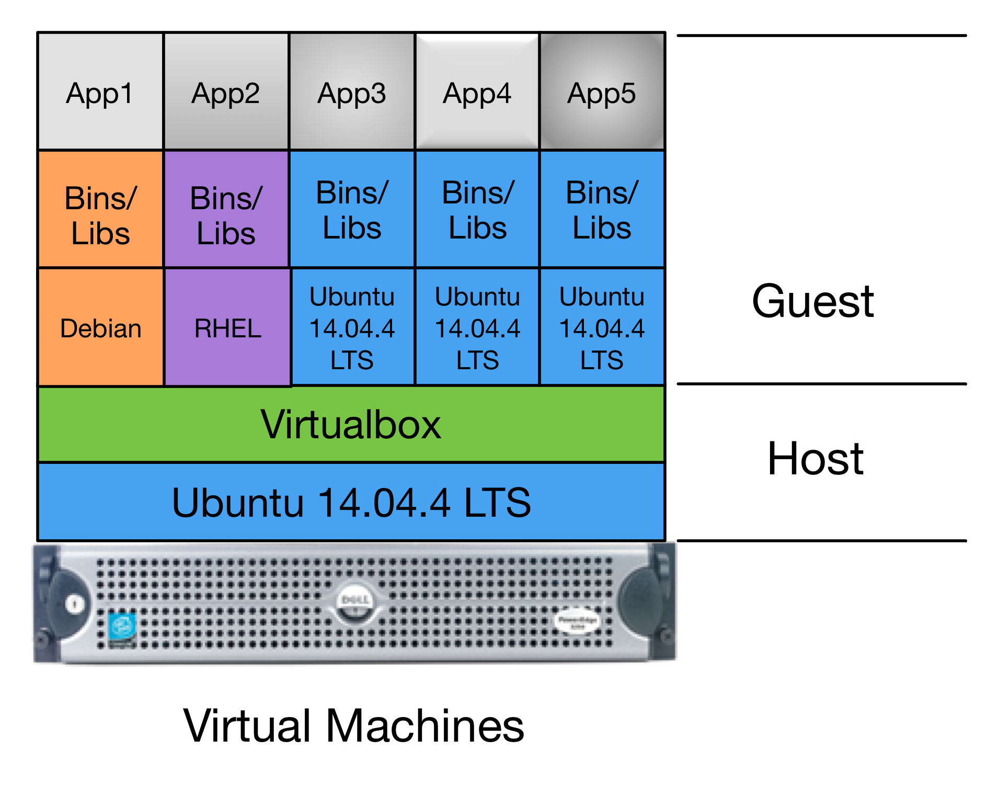

   Pure Virtual Machine Architecture

..

The deployment we are currently creating is even simpler than Figure
:ref:`VM-Architecture`.  There is the one bare-metal server acting as the
Ansible control host and Virtualbox hypervisor (``dellr510``) and just two
virtual machine guests (``yellow`` and ``purple``, a.k.a. the ``trident``
group). These guests will use bridged interfaces so they each have an
Internet-facing IP address and domain name, as well as a private virtual LAN
that is shared with the host for Ansible control and administration. For
increased security, the bare-metal VM host will only be accessible through an
internal VLAN.

.. _manual_install_vms:

Manual Installation of Virtual Machines
---------------------------------------

This section walks through the process of manually creating two
Debian 8.5 virtual machines to serve as Trident trust group
portal servers. This deployment combines all of the Trident
related services into one virtual machine. One of the two
vitual machines (``yellow``) will serve as the "production"
portal, and the other identical system (``purple``) will
serve as a development/test server. The latter can be used to
experiment with upgrades, test Ansible playbook changes,
train system administrators and trust group administrators.

Start the Virtualbox management GUI in the Remmina VNC
window.

.. _vnc_connected:

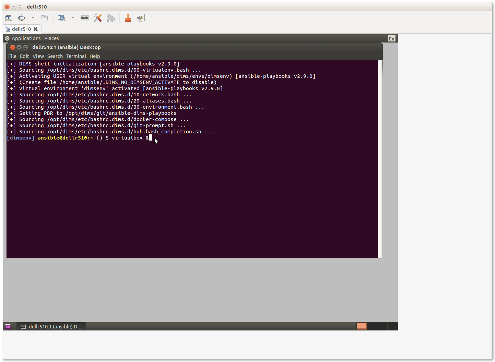

   Running Virtualbox management GUI over VNC

..

This should bring up the Virtualbox management GUI.

.. _remmina_virtualbox:

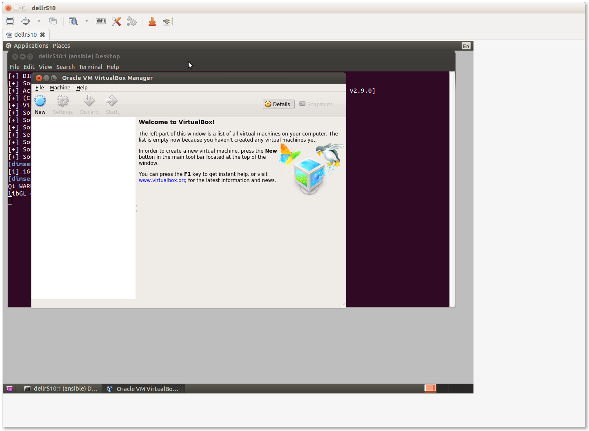

   Virtualbox management GUI

..

Select **New** to create a new virtual machine.  Most tabs have a **Next>**
button to go to the following tab, or select **Settings** after highlighting
the VM you want to configure, or and press the **Right mouse button** and chose
**Settings...** or use the keyboard shortcut **CTRL-S**.

.. _remmina_yellow_initial:

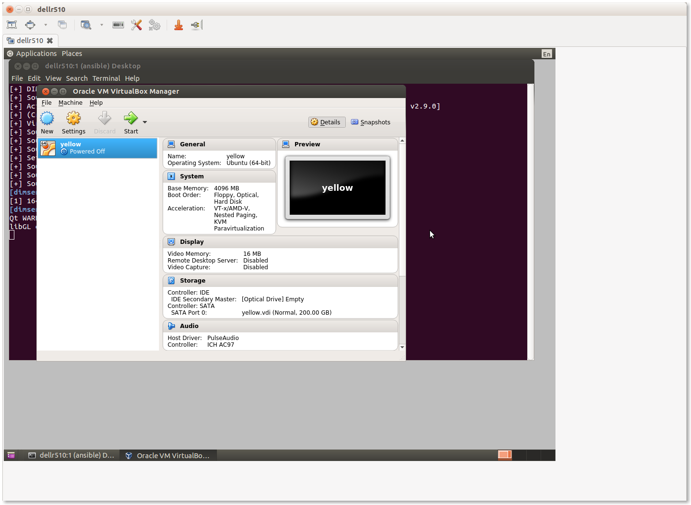

   Initial ``yellow`` VM

..

Individual groupings of settings (e.g., **System** for boot order, processor
settings, etc., **Storage** for virtual hard drives, **Network** for NICs) are
on the left of the **Settings** panel.

.. _remmina_vm_boot_order:

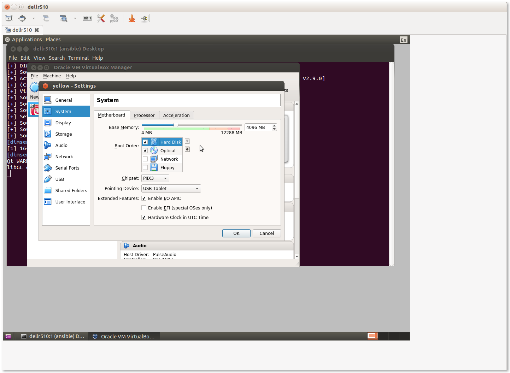

   VM System Settings

..

Navigate through the menus to set the following attributes:

    + Set Name: ``yellow``
    + Set Type: **Linux**
    + Set Version: **Ubuntu (64-bit)**
    + Set memory (e.g., **4096 MB**)
    + Create a virtual disk, type **VDI (VirtualBox Disk Image)**, dynamically
      allocated, making it generously large in relation to available disk space
      to provide adequate storage space for Trident upload files (e.g., **200GB**).
    + Configure three NICs:

        + Adapter **1** should be attached to **NAT** to provide host-only access with
          NAT to get to the Internet while setting up the VM.
      
        + Adapter **2** should be attached to **Bridged Adapter**, name ``em2`` in this
          case. (This is the host NIC attached to the internal VLAN in this configuration).
          This interface in the guest (``eth1``) will be used for local Ansible control
          and communication with internal hosts.
    
        + Adapter **3** should be attached to **Bridged Adapter**, name ``em1`` in this
          case.  (This is the host NIC attached to the Internet in this configuration,
          which will be set to ``0.0.0.0`` to prevent direct communication from the
          Internet to the VM host using this interface).  This interface in the guest
          (``eth2``) will have the public IP address for the Trident portal, email
          delivery, etc.

    + Set the system boot order to be **Hard Disk** first, followed by
      **Optical** drive. The first boot with an empty hard drive will boot from
      the **Optical** drive, while subsequent reboots will use the operating
      system installed on the **Hard Disk**.

    + Increase the number of CPUs (for a 16 core VM host, 3 or 4 cores is
      reasonable.)

.. note::

   All of these settings can be tuned later on if it is determined that they
   are too low (or too high). Use a program like ``htop`` on the virtual machine
   host to watch things like CPU saturation, memory saturation, swap usage,
   etc.

..

After configuring the first VM ``yellow``, produce a full clone of the VM and
name it ``purple``.  This will be the backup Trident server. Check the box to
regenerate MAC addresses for the network interfaces to ensure that they are
separable at the packet level in case network diagnostics need to be performed
using ``tcpdump`` or other network tools.

Once both of the VMs are set up, start them to boot from the Debian installation
ISO attached to the virtual DVD drive.

.. note::

   We are not using Kickstart here, as we did for the baremetal host in Section
   :ref:`bootstrapping`, which means that a number of steps that were
   automatically performed during system installation will need to be performed
   manually.  This is an area of automation that needs further work to unify
   and standardize the boot process using Kickstart from Jinja templates and
   inventory variables, allowing a consistent, configurable, repeatable, and
   much faster system setup. This will result in time and cost savings that
   scale better and help new teams more quickly deploy a full system.

..

* Use LVM on the entire drive, with separate partitions for ``/tmp``, ``/home``,
  and ``/var``.

* Choose **Debian desktop environment**, with **Gnome**, de-select **print
  server** and select **SSH server**, leaving **standard system utilities**
  selected, and press **Tab** and **Enter** to **Continue**.

* Create the ``ansible`` account using the password you created for this
  deployment. Also set the ``root`` password (ideally to a different password
  than the ``ansible`` account, to be used for emergency console access when
  and if something disables access to the ``ansible`` account.)

At the end of the operating system installation process, it will ask you
to reboot. The guest should then show the Grub boot menu and proceed
to boot into Debian, presenting the login screen when the system is up
and running.

.. _remmina_yellow_up:

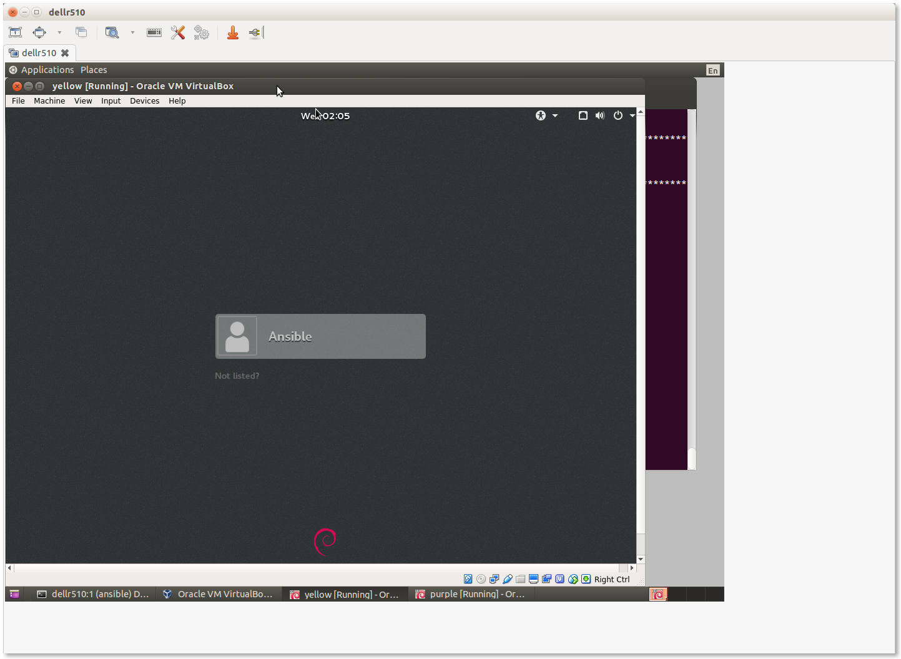

   Login screen for ``yellow`` VM

..

.. _bootstrapping_vms:

Bootstrapping the New VMs
-------------------------

Before you can perform the bootstrapping process using Ansible, you must
configure at least one network interface on each VM guest (as well as setting
an IP address in the same network block on the bridged interface of the host)
to allow host-to-guest SSH access.

Manually edit the ``/etc/network/interfaces`` file to configure the initial
``eth1`` NIC to have the IP addresses assigned for the hosts in the inventory
file. Bring the interface up using ``ifup eth1`` and test after setting up all
of the interfaces using the same steps as shown in Section
:ref:`full_network_connectivity`.

Once connectivity has been verified, apply the ``bootstrap.yml`` playbook
as shown in Section :ref:`bootstrapping_ansible_control`, using the
``trident`` group this time to bootstrap both VMs at the same time.

.. _remmina_bootstrap_trident:

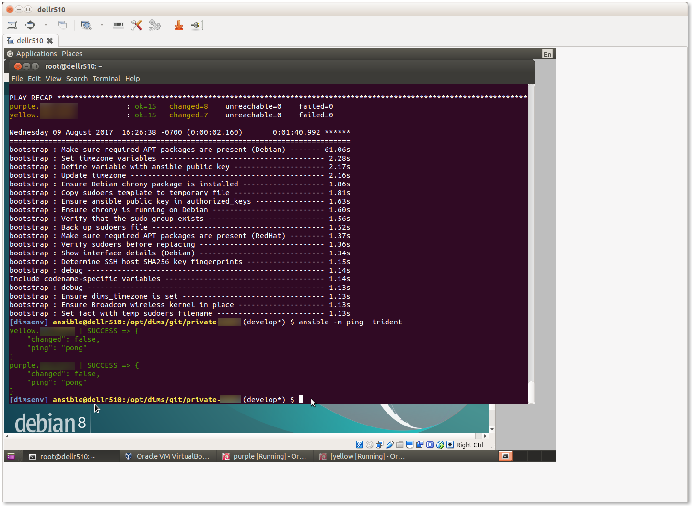

   Bootstrapping the ``trident`` group

..

.. _initial_provision_vms:

Initial Provisioning of the New VMs
-----------------------------------

Lastly, we will run the initial provisioning steps to install and configure
the two new VMs. For the purposes of this example, we will start by only
applying the ``base`` role tasks to make sure the fundamentals of our
customized configuration will work. The command we use is:

.. code-block:: none

    $ ansible-playbook $GIT/private-develop/master.yml --tags base --limit trident

..

.. _remmina_base_role:

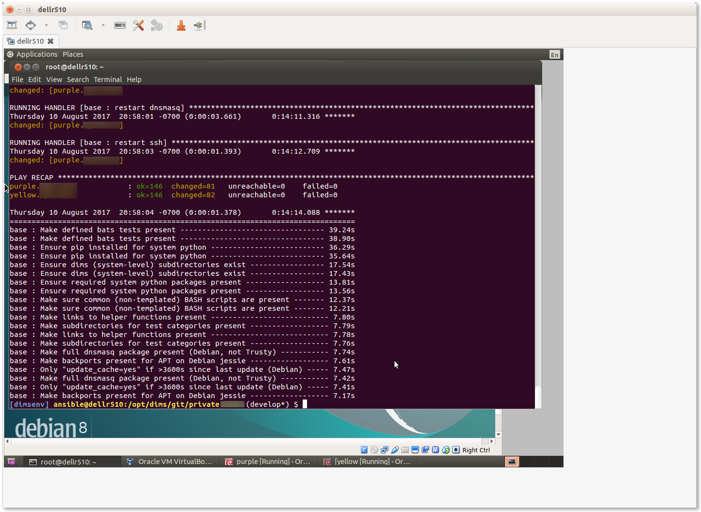

   Applying ``base`` role to ``trident`` group

..

Having applied the ``base`` role, network interfaces are set up,
``iptables`` rules are in place, ``/etc/hosts`` file and DNS
resolution are configured, and packages have been updated. This would
be a good time to reboot both systems to ensure everything is applied
and functions. You can use Ansible ad-hoc mode to do this with
the command:

.. code-block:: none

    $ ansible -m shell --become -a 'shutdown -r now' trident`

..

After a minute or two, you can test connectivity again with the
command:

.. code-block:: none

    $ ansible -m shell -a 'uptime' trident`
    purple.devops.develop | SUCCESS | rc=0 >>
     14:22:33 up 0 min,  1 user,  load average: 0.86, 0.22, 0.07

    yellow.devops.develop | SUCCESS | rc=0 >>
     14:22:33 up 0 min,  1 user,  load average: 0.79, 0.25, 0.09

..

At this point, the hosts are ready for application of their full playbooks.
Use ``--limit trident`` when running the ``master.yml`` playbook to only
operate on the two VMs in question.

.. note::

   If Ansible Vault is being used to encrypt any secrets on disk, you will
   need to either provide the password using the ``--ask-vault-pass``
   command line option or provide a path to the Vault password file
   using the ``--vault-password-file`` command line option. We will use
   the latter in this example:

.. _remmina_trident_fullplaybook_start:

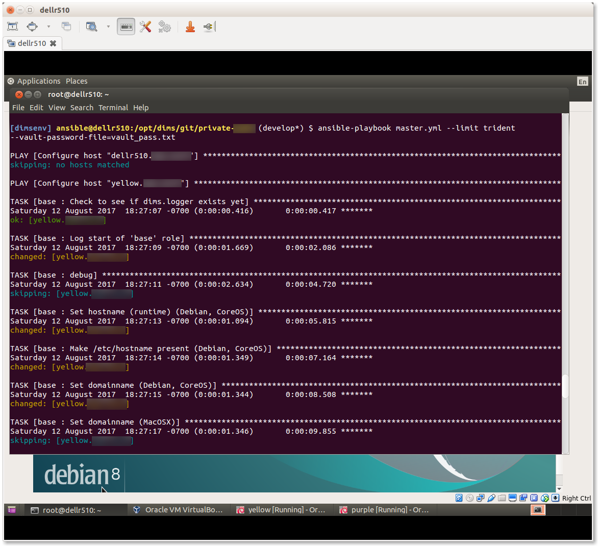

   Applying full playbook to ``trident`` group

..

.. attention::

    The ``nginx`` role is designed to support use of Letsencrypt for SSL
    certificate generation. Because Letsencrypt imposes a limit on the number of
    certificates that can be generated for a given DNS domain name per week,
    the default is to use the "staging" facility (i.e., the default is
    ``certbot_staging: yes`` globally.) It may take a few full playbook
    runs to ensure that all variables are defined and set properly, which
    could exhaust the limit of certificates if the default was to generate
    real certificates each time the ``nginx`` role gets applied.

    After you are sure things are working properly, edit the
    ``inventory/trident/nodes.yml`` file and change the setting to
    ``certbot_staging: no`` and apply the ``nginx`` role one more time to get
    valid certificates.

    Once valid certificates have been generated once, you can create a backup
    that can be restored later for development testing purposes in case you
    have to destroy the ``/etc/letsencrypt`` directory and start again (as
    occurs when using Vagrants and doing ``vagrant destroy``, or terminating
    virtual machines in cloud service providers.) This process is described
    in Chapter :ref:`creating_a_backup`.

..

.. _remmina_trident_fullplaybook_summary:

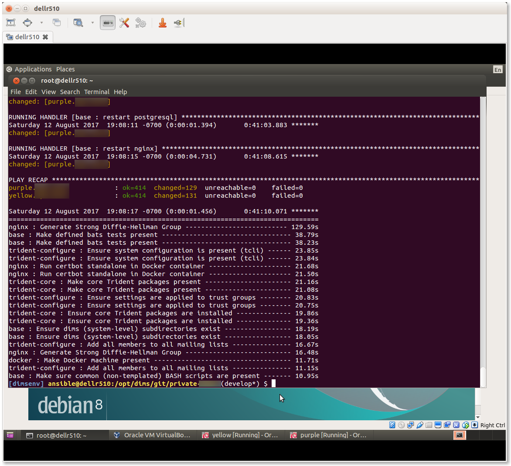

   Summary of full playbook run

..

This completes the installation of the two VMs. At this point, it
would be a good idea to create snapshots of the VMs in this
initial working state to have something to fall back on in
case of mistakes at a later date.  See `How to use snapshots in VirtualBox`_
and the Virtualbox document, `Chapter 1. First steps`_.

.. _remmina_snapshots:

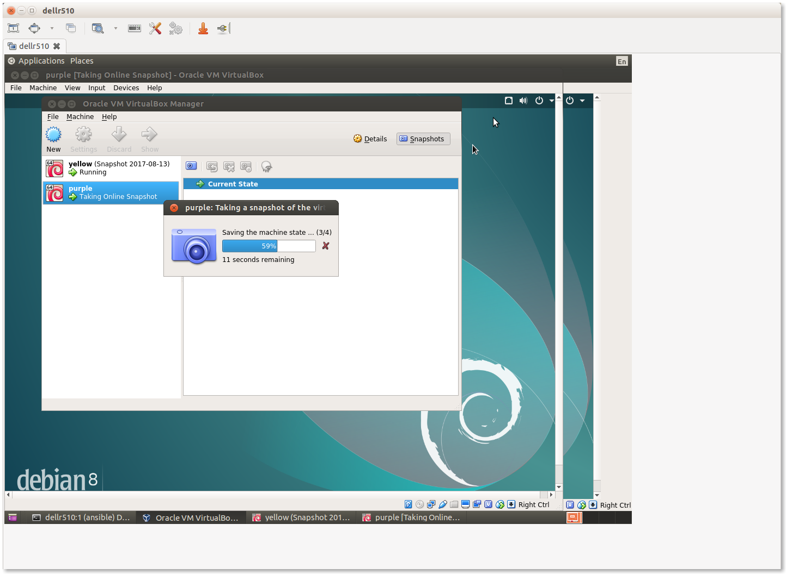

   Creating Snapshots in Virtualbox

..

.. _Letsencrypt: https://letsencrypt.org/
.. _How to use snapshots in VirtualBox: http://www.techrepublic.com/article/how-to-use-snapshots-in-virtualbox/
.. _Chapter 1. First steps: https://www.virtualbox.org/manual/ch01.html
