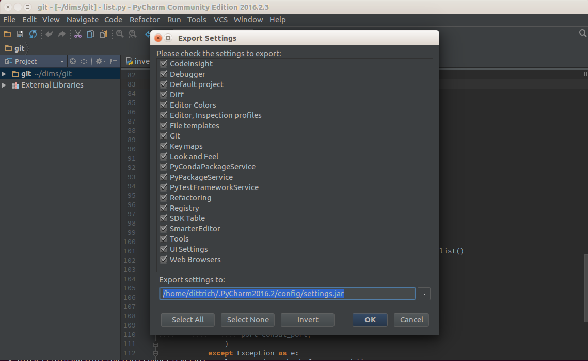
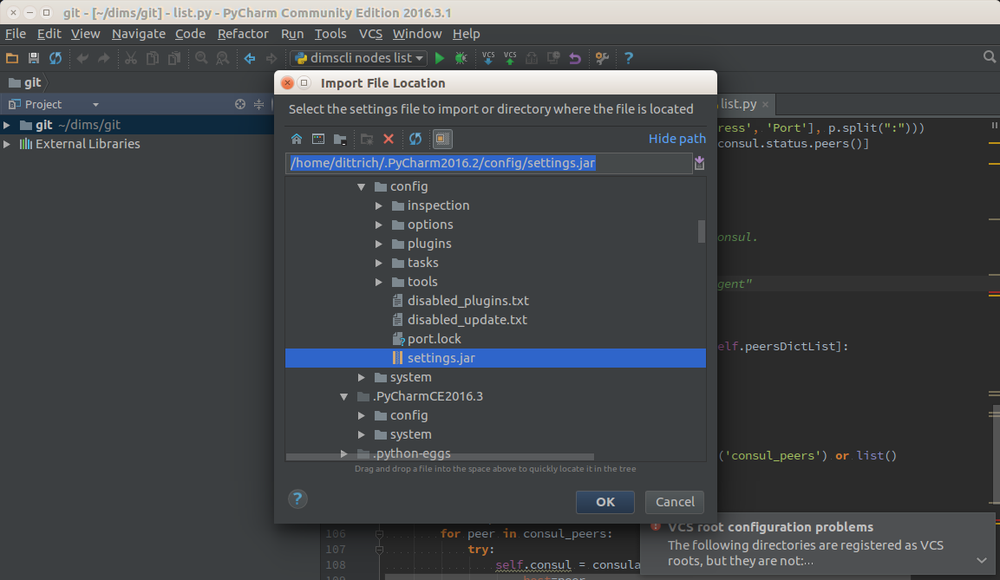

.. _maintenance:

Regular System Maintenance
==========================

This chapter covers regular system maintenance tasks, such as updating the
``ansible-dims-playbooks`` repo and related private customization repository,
upgrading operating system packages, and generally keeping system components
clean and up to date.

.. _updating_packages:

Updating Operating System Packages
----------------------------------

Updating system packages, especially security patches, is an important
part of ensuring the integrity, availability, and confidentiality of
information and information systems. The availability aspect is sometimes
a concern when applying updates, so using the multi-deployment model
adopted by the DIMS Project to allow easier testing of system components
after patching on a test deployment before applying updates to
"production" deployment systems helps allay concerns.

There are two ``bats`` system tests that are designed to make the
normal system updating process easier to automate and apply across
the entire deployment: the ``system/updates`` and ``system/reboot``
tests. Both of these tests can be run at once using the following
command line:

.. code-block:: none

    $ test.runner --match "updates|reboot"
    [+] Running test system/updates
     ✗ [S][EV] All APT packages are up to date (Ubuntu)
       (from function `assert' in file system/helpers.bash, line 18,
        in test file system/updates.bats, line 11)
         `assert "0 packages can be updated. 0 updates are security updates." bash -c "/usr/lib/update-notifier/apt-check --human-readable"' failed
       linux-headers-4.4.0-92-generic
       google-chrome-stable
       xul-ext-ubufox
       firefox
       linux-image-4.4.0-92-generic
       linux-generic-lts-xenial
       libgd3
       linux-headers-4.4.0-92
       linux-headers-generic-lts-xenial
       linux-image-extra-4.4.0-92-generic
       linux-image-generic-lts-xenial
       expected: "0 packages can be updated. 0 updates are security updates."
       actual:   "11 packages can be updated.10 updates are security updates."

    1 test, 1 failure

    [+] Running test system/reboot
     ✓ [S][EV] System does not require a reboot (Ubuntu)

    1 test, 0 failures

..

In this case, the tests show that the system has updates most of them security
updates, ready to apply. The ``updates`` test failed, but the ``reboot`` test
passed.

Now apply the ``updates`` tag to update and install upgrades.

.. code-block:: none

    $ run.playbook --tags updates -e packages_upgrade=yes

    PLAY [Configure host "dimsdemo1.devops.develop"] ******************************
    . . .
    TASK [base : Check to see if update-manager is running on Ubuntu] *************
    Wednesday 16 August 2017  13:06:29 -0700 (0:00:01.049)       0:00:05.392 ******
    changed: [dimsdemo1.devops.develop]

    TASK [base : Kill update_manager to avoid dpkg lock contention] ***************
    Wednesday 16 August 2017  13:06:30 -0700 (0:00:01.239)       0:00:06.631 ******
    skipping: [dimsdemo1.devops.develop]

    TASK [base : Check to see if gpk-update-viewer is running on Ubuntu] **********
    Wednesday 16 August 2017  13:06:31 -0700 (0:00:01.049)       0:00:07.681 ******
    skipping: [dimsdemo1.devops.develop]

    TASK [base : Kill gpk-update-viewer to avoid dpkg lock contention] ************
    Wednesday 16 August 2017  13:06:32 -0700 (0:00:01.048)       0:00:08.729 ******
    skipping: [dimsdemo1.devops.develop]

    TASK [base : Make sure blacklisted packages are absent (Debian)] **************
    Wednesday 16 August 2017  13:06:33 -0700 (0:00:01.084)       0:00:09.814 ******
    ok: [dimsdemo1.devops.develop] => (item=[u'modemmanager', u'resolvconf',
    u'sendmail', u'whoopsie', u'libwhoopsie0'])

    TASK [base : Only "update_cache=yes" if >3600s since last update (Debian)] ****
    Wednesday 16 August 2017  13:06:35 -0700 (0:00:02.015)       0:00:11.829 ******
    ok: [dimsdemo1.devops.develop]

    TASK [base : Make sure required APT packages are present (Debian)] ************
    Wednesday 16 August 2017  13:06:37 -0700 (0:00:01.610)       0:00:13.440 ******
    ok: [dimsdemo1.devops.develop] => (item=[u'apt-transport-https', u'bash-completion',
    u'ca-certificates', u'cpanminus', u'curl', u'dconf-tools', u'git-core',
    u'default-jdk', u'gitk', u'gnupg2', u'htop', u'hunspell', u'iptables-persistent',
    u'ifstat', u'make', u'myrepos', u'netcat', u'nfs-common', u'chrony', u'ntpdate',
    u'openssh-server', u'patch', u'perl', u'postfix', u'python', u'python-apt',
    u'remake', u'rsync', u'rsyslog', u'sshfs', u'sshpass', u'strace', u'tree', u'vim',
    u'xsltproc', u'chrony', u'nfs-kernel-server', u'smartmontools', u'unzip'])

    TASK [base : Make upgraded packages present if we are explicitly upgrading] ***
    Wednesday 16 August 2017  13:06:38 -0700 (0:00:01.750)       0:00:15.190 ******
    changed: [dimsdemo1.devops.develop]

    TASK [base : Check proxy availability] ****************************************
    Wednesday 16 August 2017  13:09:12 -0700 (0:02:33.389)       0:02:48.580 ******
    . . .
    PLAY RECAP ********************************************************************
    dimsdemo1.devops.develop   : ok=72   changed=4    unreachable=0    failed=0

    Wednesday 16 August 2017  13:10:28 -0700 (0:00:01.069)       0:04:04.737 ******
    ===============================================================================
    base : Make upgraded packages present if we are explicitly upgrading -- 153.39s
    . . .

..

.. note::

   The flag ``-e packages_upgrade=yes`` sets the variable ``packages_upgrade`` that
   must evaluate to true in order for packages to be updated in the role. This is
   to ensure that package updates are done in a controlled manner. Set this
   variable to something that Ansible evaluates as true on the command line, or
   somewhere in the host vars section of the inventory.

..

Now re-run the two tests.

.. code-block:: none

    $ test.runner --match "updates|reboot"
    [+] Running test system/updates
     ✓ [S][EV] All APT packages are up to date (Ubuntu)

    1 test, 0 failures

    [+] Running test system/reboot
     ✗ [S][EV] System does not require a reboot (Ubuntu)
       (in test file system/reboot.bats, line 8)
         `@test "[S][EV] System does not require a reboot (Ubuntu)" {' failed
       linux-image-4.4.0-92-generic
       linux-base
       linux-base

    1 test, 1 failure

..

This time the updates test passes, but notice that some of the updates
require a reboot, so that test fails. This means that a reboot needs to
be planned and executed carefully, to ensure minimal disruption to anything
dependent on this system (e.g., running virtual machines on a development
system).

.. attention::

    A developer workstation or production VM host running virtual machines
    needs to have the virtual machines shut down or suspended prior to a
    reboot of the VM host in order to ensure the VMs or the VM host does
    not lose network interfaces that are using DHCP. The VM host may
    lose a ``vboxnet`` interface, a VM may lose an ``eth`` interface,
    or both.

      + Vagrants are handled as part of the shutdown process when you
        use the ``dims.shutdown`` wrapper script. After reboot, use
        ``dims.shutdown --resume`` (optionally with ``--group`` to select
        specific Vagrants by name or group) to resume them.

      + Virtualbox VMs that were created by hand are not yet supported by
        ``dims.shutdown``.  Use the ``virtualbox`` management GUI to cleanly
        shut down any running VMs (and again after reboot, to bring them back
        up.) If this is a remote VM host, use ``remmina`` and the VNC wrapper
        script described in Section :ref:`validating_vnc` to run the
        ``virtualbox`` management GUI remotely.

..

Using Ansible ad-hoc mode, the checks can be performed on multiple
hosts at once:

.. code-block:: none

    $ ansible -m shell -a 'test.runner --match reboot' trident
    yellow.devops.develop | SUCCESS | rc=0 >>
    # [+] Running test system/reboot
    1..1
    ok 1 [S][EV] System does not require a reboot (Debian)
    #

    purple.devops.develop | SUCCESS | rc=0 >>
    # [+] Running test system/reboot
    1..1
    ok 1 [S][EV] System does not require a reboot (Debian)
    #

..

As a convenience for the system administrator, a ``cron`` job
is managed by the ``base`` role that runs a script named
``dims.updatecheck`` on a daily basis.  The variables
that control the ``cron`` job are defined in the
``group_vars/all/dims.yml`` file:

.. code-block:: yaml

    cronjobs:
      - name: 'dims.updatecheck'
        weekday: '*'
        hour: '6'
        minute: '0'
        user: 'ansible'
        job: '{{ dims_bin }}/dims.updatecheck'

..

The ``base`` role creates the following file:

.. code-block:: none

    $ cat /etc/cron.d/dims
    #Ansible: dims.updatecheck
    0 6 * * * ansible /opt/dims/bin/dims.updatecheck

..

When updates are available, or a reboot is required, email is
sent to the ``root`` account. Make sure that email to this
account is forwarded by setting the ``postmaster`` variable
to a valid email address. An example of the message that
will be sent is shown here:

.. code-block:: none

    To: dittrich@u.washington.edu
    Subject: dims.updatecheck results from purple.ops.ectf (2017-09-01T23:06:02.211268+00:00)
    Message-Id: <20170901230603.9D3C3582@breathe.prisem.washington.edu>
    Date: Fri,  1 Sep 2017 16:06:03 -0700 (PDT)
    From: root@breathe.prisem.washington.edu (root)

    -----------------------------------------------------------------------

    Host: purple.ops.ectf
    Date: 2017-09-01T23:06:02.211268+00:00

    This is a report of available package updates and/or required reboot
    status.  The output of the bats tests that were run is included below.

    If package updates are necessary, this can be accomplished by running
    the Ansible playbook for purple.ops.ectf with the following options:

       --tags updates -e packages_update=true

    If a reboot is necessary, ensure that the host (and anyone using it)
    is prepared for the reboot:

      o Ensure that all users of external services are aware of any
        potential outage of services provided by this host (or its
        (VMs).

      o Halt or suspend any VMs if this is a VM host (and be prepared
        to ensure they are restart after rebooting is complete.)
        (Use the "dims.shutdown" script to facilitate this. See
        documentation and/or "dims.shutdown --usage".)

      o Notify any active users to ensure no active development work
        is lost.

    -----------------------------------------------------------------------
    test.runner --tap --match "updates|reboot"

    # [+] Running test system/updates
    1..1
    not ok 1 [S][EV] All APT packages are up to date (Debian)
    # (from function `assert' in file system/helpers.bash, line 18,
    #  in test file system/updates.bats, line 12)
    #   `assert "0 packages can be updated." bash -c "apt list --upgradable 2>/dev/null"' failed
    #
    # WARNING: apt does not have a stable CLI interface yet. Use with caution in scripts.
    #
    # expected: "0 packages can be updated."
    # actual:   "Listing...firefox-esr/oldstable 52.3.0esr-1~deb8u2 amd64 [upgradable fro
    m: 52.2.0esr-1~deb8u1]gir1.2-soup-2.4/oldstable 2.48.0-1+deb8u1 amd64 [upgradable fro
    m: 2.48.0-1]git/oldstable 1:2.1.4-2.1+deb8u4 amd64 [upgradable from: 1:2.1.4-2.1+deb8
    u3]git-core/oldstable 1:2.1.4-2.1+deb8u4 all [upgradable from: 1:2.1.4-2.1+deb8u3]git
    -man/oldstable 1:2.1.4-2.1+deb8u4 all [upgradable from: 1:2.1.4-2.1+deb8u3]gitk/oldst
    able 1:2.1.4-2.1+deb8u4 all [upgradable from: 1:2.1.4-2.1+deb8u3]iceweasel/oldstable
    52.3.0esr-1~deb8u2 all [upgradable from: 52.2.0esr-1~deb8u1]libdbd-pg-perl/jessie-pgd
    g 3.6.2-1~pgdg80+1 amd64 [upgradable from: 3.4.2-1]libgd3/oldstable 2.1.0-5+deb8u10 a
    md64 [upgradable from: 2.1.0-5+deb8u9]libpq5/jessie-pgdg 9.6.4-1.pgdg80+1 amd64 [upgr
    adable from: 9.4.13-0+deb8u1]libsoup-gnome2.4-1/oldstable 2.48.0-1+deb8u1 amd64 [upgr
    adable from: 2.48.0-1]libsoup2.4-1/oldstable 2.48.0-1+deb8u1 amd64 [upgradable from:
    2.48.0-1]"
    #
    # [+] Running test system/reboot
    1..1
    ok 1 [S][EV] System does not require a reboot (Debian)
    #

    -----------------------------------------------------------------------

..

.. _renewing_letsencrypt_certs:

Renewing Letsencrypt Certificates
---------------------------------

The imported role `ansible-role-certbot`_ that is being used
for `Letsencrypt`_ support creates a ``crontab`` entry in the ``ansible``
account to automatically renew the certificate when it is about to expire. You
can see the ``crontab`` entry using Ansible ad-hoc mode:

.. code-block:: none

    $ ansible -m shell -a 'crontab -l' trident
    yellow.devops.develop | SUCCESS | rc=0 >>
    #Ansible: Certbot automatic renewal.
    20 5 * * * /opt/certbot/certbot-auto renew --quiet --no-self-upgrade

    purple.devops.develop | SUCCESS | rc=0 >>
    #Ansible: Certbot automatic renewal.
    20 5 * * * /opt/certbot/certbot-auto renew --quiet --no-self-upgrade

..

You can always run this command whenever you want, again using
Ansible ad-hoc mode:

.. code-block:: none

    $ ansible -m shell -a '/opt/certbot/certbot-auto renew --no-self-upgrade' trident
    purple.devops.develop | SUCCESS | rc=0 >>
    Requesting root privileges to run certbot...
      /home/ansible/.local/share/letsencrypt/bin/letsencrypt renew --no-self-upgrade

    -------------------------------------------------------------------------------
    Processing /etc/letsencrypt/renewal/breathe.prisem.washington.edu.conf
    -------------------------------------------------------------------------------

    The following certs are not due for renewal yet:
      /etc/letsencrypt/live/breathe.prisem.washington.edu/fullchain.pem (skipped)
    No renewals were attempted.Saving debug log to /var/log/letsencrypt/letsencrypt.log
    Cert not yet due for renewal

    yellow.devops.develop | SUCCESS | rc=0 >>
    Requesting root privileges to run certbot...
      /home/ansible/.local/share/letsencrypt/bin/letsencrypt renew --no-self-upgrade

    -------------------------------------------------------------------------------
    Processing /etc/letsencrypt/renewal/echoes.prisem.washington.edu.conf
    -------------------------------------------------------------------------------

    The following certs are not due for renewal yet:
      /etc/letsencrypt/live/echoes.prisem.washington.edu/fullchain.pem (skipped)
    No renewals were attempted.Saving debug log to /var/log/letsencrypt/letsencrypt.log
    Cert not yet due for renewal

..

.. _updating_secondary:

Updating Secondary Components
-----------------------------

The package update steps above perform what you could call a
*first order* update process, that is, updating the packages for
the major components of the operating system. Some of these components,
however, themselves use plugins or other sub-components that require
updating. This is most disruptive for major releases (e.g., going
from PyCharm ``2016.2`` to ``2016.3``, as shown in the next section).

A development system will have more of these components requiring
secondary updates. Partly because of this reason, these type of
components are pinned to a specific version. When updating the
``ansible-dims-playbooks``, take note of the changes and check
for required secondary updates.

.. attention::

    You will sometimes need to communicate the need for these secondary
    updates to users of the system (e.g., to developers) because some
    tools like Vagrant and PyCharm keep plugins in users' accounts,
    not in system directories.  As it is difficult to automate this
    process in a robust way, each user must take responsibility for
    updating their own plugins to avoid having their toolset go
    out-of-sync with other developers and cause random failures
    that are difficult to track down.

..

.. todo::

   TODO(dittrich): Add bats tests to users' shell init process to check for updates

..

In this section, we cover updating Vagrant and PyCharm.

.. _updating_vagrant:

Updating Vagrant Plugins
~~~~~~~~~~~~~~~~~~~~~~~~

Vagrant is used for development using Virtualbox virtual
machines. It has a few plugins that were adopted (or at
least experimentally used) during DIMS development.

After upgrading Vagrant to a new version, users can update
their plugins with the following command:

.. code-block:: none

    $ vagrant plugin update
    Updating installed plugins...
    Fetching: vagrant-ignition-0.0.3.gem (100%)
    Successfully uninstalled vagrant-ignition-0.0.1
    Updated 'vagrant-ignition' to version '0.0.3'!
    Updated 'vagrant-scp' to version '0.5.7'!
    Updated 'vagrant-share' to version '1.1.9'!
    Updated 'vagrant-triggers' to version '0.5.3'!
    Updated 'vagrant-vbguest' to version '0.14.2'!

..

.. _updatingpycharm:

Updating PyCharm Community Edition
~~~~~~~~~~~~~~~~~~~~~~~~~~~~~~~~~~

Now that we have seen an example of setting variables at the host level
that override group variables, and validating the values of those variables
at run time, we will see how an example of upgrading the application.

PyCharm keeps all of its state, including settings, breakpoints, indexes, in internal
data stores in a directory specific to the version of PyCharm being used.  For example,
PyCharm 2016.2.3 files are kept in ``$HOME/.PyCharm2016.2``. When updating to the
release ``2016.3.1``, the location changes to ``$HOME/.PyCharmCE2016.3``. You need
to run PyCharm ``2016.2.3`` to export your settings, then run the new PyCharm
``2016.3.1`` version to import them.

To export settings, run PyCharm ``2016.2.3`` and select **File>Export
Settings...**. A dialog will pop up that allows you to select what to export and
where to export it. You can use the defaults (pay attention to where the exported
setting file is located, since you need to select it in the next step.) Select
**Ok** to complete the export. See Figure :ref:`exportsettings`.

.. _exportsettings:

   Exporting Settings from PyCharm 2016.2.3

..

PyCharm is installed using Ansible. The normal workflow for updating a component
like PyCharm is to test the new version to ensure it works properly, then update
the variables for PyCharm in the Ansible ``inventory`` before exporting your old
settings and then running the ``pycharm`` role for your development system.

.. TODO(dittrich): Add a cross-reference to running the playbook
.. todo::

    Add a cross-reference to running the playbook.

..

After PyCharm has been updated, select **File>Import Settings...** and select
the ``.jar`` file that was created in the previous step and then select **Ok**.
Again, the defaults can be used for selecting the elements to import.
See Figure :ref:`importsettings`.

.. _importsettings:

   Importing Settings to PyCharm 2016.3.1

..

Once you have completed this process and are successfully using version ``2016.3.1``,
you can delete the old directory.

.. code-block:: none

   $ rm -rf ~/.PyCharm2016.2

..

.. _Letsencrypt: https://letsencrypt.org/
.. _ansible-role-certbot: https://github.com/geerlingguy/ansible-role-certbot
