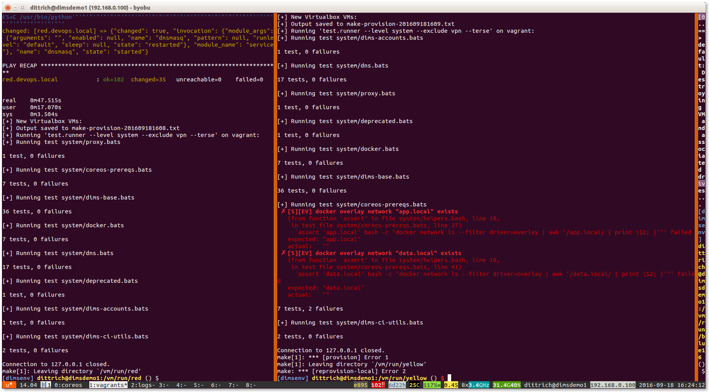

.. _tests:

Testing System Components
=========================

The DIMS project has adopted use of the `Bats: Bash Automated Testing System`_
(known as ``bats``) to perform simple tests in a manner that produces
parsable output following the `Test Anything Protocol`_ (TAP).

Bats is a **TAP Producer**, whose output can be processed by one of
many `TAP Consumers`_, including the Python program `tap.py`_.

.. _Bats\: Bash Automated Testing System: https://github.com/sstephenson/bats#bats-bash-automated-testing-system
.. _Test Anything Protocol: http://testanything.org
.. _TAP Consumers: http://testanything.org/consumers.html
.. _tap.py: https://pypi.python.org/pypi/tap.py

.. _bats:

Organizing Bats Tests
~~~~~~~~~~~~~~~~~~~~~

This section covers the basic functionality of ``bats`` and
how it can be used to produce test results.

We should start by looking at the ``--help`` output for ``bats`` to understand
how it works in general.

.. code-block:: none

    $ bats -h
    Bats 0.4.0
    Usage: bats [-c] [-p | -t] <test> [<test> ...]

      <test> is the path to a Bats test file, or the path to a directory
      containing Bats test files.

      -c, --count    Count the number of test cases without running any tests
      -h, --help     Display this help message
      -p, --pretty   Show results in pretty format (default for terminals)
      -t, --tap      Show results in TAP format
      -v, --version  Display the version number

      For more information, see https://github.com/sstephenson/bats

..

As is seen, multiple tests -- files that end in ``.bats`` -- can be passed
as a series of arguments on the command line.  This can be either individual
arguments, or a wildcard shell expression like ``*.bats``.

If the argument evaluates to being a directory, ``bats`` will look through that
directory and run all files in it that end in ``.bats``.

.. caution::

    As we will see, ``bats`` has some limitations that do not allow mixing file
    arguments and directory arguments. You can either give ``bats`` one or more
    files, or you can give it one or more directories, but you **cannot mix
    files and directories**.

..

To see how this works, let us start with a simple example that has tests that
do nothing other than report success with their name.  In this case, test
``a.bats`` looks like this:

.. code-block:: bash

    #!/usr/bin/env bats

    @test "a" {
        [[ true ]]
    }

..

We produce three such tests, each in their own directory, following this
organizational structure:

.. code-block:: none

    $ tree tests
    tests
    ├── a
    │   └── a.bats
    └── b
        ├── b.bats
        └── c
            └── c.bats

    3 directories, 3 files

..

Since the hierarchy shown here does not contain tests itself, but rather holds
directories that in turn hold tests, how does we run the tests?

Running ``bats`` with an argument that includes the highest level of the
directory hierarchy does not work to run any of the tests in subordinate
directories:

.. code-block:: none

    $ bats tests

    0 tests, 0 failures

..

Running ``bats`` and passing a directory that contains files with
names that end in ``.bats`` runs all of the tests in *that
directory*.

.. code-block:: none

    $ bats tests/a
     ✓ a

    1 test, 0 failures

..

If we specify the next directory ``tests/b``, then ``bats``
will run the tests in that directory that end in ``.bats``,
but will not traverse down into the ``tests/b/c/`` directory.

.. code-block:: none

    $ bats tests/b
     ✓ b

    1 test, 0 failures

..

To run the tests in the lowest directory, that specific
directory must be given on the command line:

.. code-block:: none

    $ bats tests/b/c
     ✓ c

    1 test, 0 failures

..

Attempting to pass all of the directories along as arguments
does not work, as seen here:

.. code-block:: none

    $ bats tests/a /tests/b tests/b/c
    bats: /tmp/b does not exist
    /usr/local/Cellar/bats/0.4.0/libexec/bats-exec-suite: line 20: let: count+=: syntax error: operand expected (error token is "+=")

..

This means that we *can* separate tests into subdirectories, to
any depth or directory organizational structure, as needed,
but tests must be run on a per-directory basis, or identified
and run as a group of tests passed as file arguments using
wildcards:

.. code-block:: none

    $ bats tests/a/*.bats tests/b/*.bats tests/b/c/*.bats
     ✓ a
     ✓ b
     ✓ c

    3 tests, 0 failures

..

Because specifying wildcards in this way, with arbitrary
depths in the hierarchy of directories below ``tests/``
is too hard to predict, use a program like ``find``
to identify tests by name (possibly using wildcards or
``grep`` filters for names), passing the results on to
a program like ``xargs`` to invoke ``bats`` on each
identified test:

.. code-block:: none

    $ find tests -name '*.bats' | xargs bats
    1..3
    ok 1 a
    ok 2 b
    ok 3 c

..

.. note::

   Note that the output changed from the examples above, which include the
   arrow ("✓") character, to now include the word ``ok`` instead in TAP
   format. This is because the default for terminals (i.e., a program that is
   using a TTY device, not a simple file handle to something like a pipe).  To
   get the pretty-print output, add the ``-p`` flag, like this:

    .. code-block:: none

        $ find tests -name '*.bats' | xargs bats -p
         ✓ a
         ✓ b
         ✓ c

        3 tests, 0 failures

    ..

..

A more realistic test is seen here. This file, ``pycharm.bats``, is the product
of a Jinja template that is installed by Ansible along with the `PyCharm`_ Community
Edition Python IDE.

.. _PyCharm: https://www.jetbrains.com/pycharm/

.. code-block:: bash

    #!/usr/bin/env bats
    #
    # Ansible managed: /home/dittrich/dims/git/ansible-playbooks/v2/roles/pycharm/templates/../templates/tests/./system/pycharm.bats.j2 modified on 2016-09-15 20:14:38 by dittrich on dimsdemo1 [ansible-playbooks v1.3.33]
    #
    # vim: set ts=4 sw=4 tw=0 et :

    load helpers

    @test "[S][EV] Pycharm is not an installed apt package." {
        ! is_installed_package pycharm
    }

    @test "[S][EV] Pycharm Community edition is installed in /opt" {
        results=$(ls -d /opt/pycharm-community-* | wc -l)
        echo $results >&2
        [ $results -ne 0 ]
    }

    @test "[S][EV] \"pycharm\" is /opt/dims/bin/pycharm" {
        assert "pycharm is /opt/dims/bin/pycharm" type pycharm
    }

    @test "[S][EV] /opt/dims/bin/pycharm is a symbolic link to installed pycharm" {
        [ -L /opt/dims/bin/pycharm ]
    }

    @test "[S][EV] Pycharm Community installed version number is 2016.2.3" {
        assert "2016.2.3" bash -c "file $(which pycharm) | sed 's|\(.*/pycharm-community-\)\([^/]*\)\(/.*$\)|\2|'"
    }

..

.. code-block:: none

    $ test.runner --level system --match pycharm
    [+] Running test system/pycharm
     ✓ [S][EV] Pycharm is not an installed apt package.
     ✓ [S][EV] Pycharm Community edition is installed in /opt
     ✓ [S][EV] "pycharm" is /opt/dims/bin/pycharm
     ✓ [S][EV] /opt/dims/bin/pycharm is a symbolic link to installed pycharm
     ✓ [S][EV] Pycharm Community installed version number is 2016.2.3

    5 tests, 0 failures

..

.. _organizingtests:

Organizing tests in DIMS Ansible Playbooks Roles
~~~~~~~~~~~~~~~~~~~~~~~~~~~~~~~~~~~~~~~~~~~~~~~~

The DIMS project uses a more elaborate version of the above example, which
uses a *drop-in* model that allows any Ansible role to drop its own
tests into a structured hierarchy that supports fine-grained test
execution control.  This drop-in model is implemented by the
``tasks/bats-tests.yml`` task playbook.

.. todo::

    Cross-reference the ``ansible-playbooks`` documentation on this task
    file.

..

To illustrate how this works, we start with an empty test directory:

.. code-block:: none

    $ tree /opt/dims/tests.d
    /opt/dims/tests.d

    0 directories, 0 files

..

The ``base`` role has the largest number of tests, since it does
the most complex foundational setup work for DIMS computer systems.
The ``template/tests`` directory is filled with Jinja template
Bash scripts and/or ``bats`` tests, in a hierarchy that includes
subdirectories for each of the defined test levels from Section
:ref:`dimstp:testlevels` of :ref:`dimstp:dimstp`.

.. code-block:: none

    $ tree base/templates/tests
    base/templates/tests
    ├── component
    ├── helpers.bash.j2
    ├── integration
    ├── README.txt
    ├── system
    │   ├── deprecated.bats.j2
    │   ├── dims-accounts.bats.j2
    │   ├── dims-accounts-sudo.bats.j2
    │   ├── dims-base.bats.j2
    │   ├── dns.bats.j2
    │   ├── proxy.bats.j2
    │   ├── sudo
    │   │   └── sudo-iptables.bats.j2
    │   └── user
    │       └── vpn.bats.j2
    └── unit
        └── dims-filters.bats.j2

    6 directories, 11 files

..

After running just the ``base`` role, the highlighted subdirectories that
correspond to each of the test levels are now present in the
``/opt/dims/tests.d/`` directory:

.. code-block:: none
   :emphasize-lines: 3,6,8,21

    $ tree /opt/dims/tests.d/
    /opt/dims/tests.d/
    ├── component
    │   └── helpers.bash -> /opt/dims/tests.d/helpers.bash
    ├── helpers.bash
    ├── integration
    │   └── helpers.bash -> /opt/dims/tests.d/helpers.bash
    ├── system
    │   ├── deprecated.bats
    │   ├── dims-accounts.bats
    │   ├── dims-accounts-sudo.bats
    │   ├── dims-base.bats
    │   ├── dims-ci-utils.bats
    │   ├── dns.bats
    │   ├── helpers.bash -> /opt/dims/tests.d/helpers.bash
    │   ├── iptables-sudo.bats
    │   ├── proxy.bats
    │   └── user
    │       ├── helpers.bash -> /opt/dims/tests.d/helpers.bash
    │       └── vpn.bats
    └── unit
        ├── bats-helpers.bats
        ├── dims-filters.bats
        ├── dims-functions.bats
        └── helpers.bash -> /opt/dims/tests.d/helpers.bash

    5 directories, 18 files

..

Here is the directory structure for tests in the ``docker`` role:

.. code-block:: none

    /docker/templates/tests
    └── system
        ├── docker-consul.bats.j2
        ├── docker-core.bats.j2
        └── docker-network.bats.j2

    1 directories, 3 files

..

If we now run the ``docker`` role, it will drop these files into
the ``system`` subdirectory.  There are now 3 additional files (see emphasized
lines for the new additions):

.. code-block:: none
   :emphasize-lines: 15,16,17

    $ tree /opt/dims/tests.d
    /opt/dims/tests.d
    ├── component
    │   └── helpers.bash -> /opt/dims/tests.d/helpers.bash
    ├── helpers.bash
    ├── integration
    │   └── helpers.bash -> /opt/dims/tests.d/helpers.bash
    ├── system
    │   ├── deprecated.bats
    │   ├── dims-accounts.bats
    │   ├── dims-accounts-sudo.bats
    │   ├── dims-base.bats
    │   ├── dims-ci-utils.bats
    │   ├── dns.bats
    │   ├── docker-consul.bats
    │   ├── docker-core.bats
    │   ├── docker-network.bats
    │   ├── helpers.bash -> /opt/dims/tests.d/helpers.bash
    │   ├── iptables-sudo.bats
    │   ├── proxy.bats
    │   └── user
    │       ├── helpers.bash -> /opt/dims/tests.d/helpers.bash
    │       └── vpn.bats
    └── unit
        ├── bats-helpers.bats
        ├── dims-filters.bats
        ├── dims-functions.bats
        └── helpers.bash -> /opt/dims/tests.d/helpers.bash

    5 directories, 21 files

..

You will see the tests being installed during ``ansible-playbook`` runs, for
example (from the ``base`` role):

.. code-block:: none

    TASK [base : Make links to helper functions present] ***************************
    Wednesday 21 December 2016  20:04:15 -0800 (0:00:00.811)       0:02:55.421 ****
    ok: [red.devops.local] => (item=[u'component', u'helpers.bash'])
    ok: [red.devops.local] => (item=[u'integration', u'helpers.bash'])
    ok: [red.devops.local] => (item=[u'system', u'helpers.bash'])
    ok: [red.devops.local] => (item=[u'system/user', u'helpers.bash'])
    ok: [red.devops.local] => (item=[u'unit', u'helpers.bash'])

    msg: All items completed
    ok: [red.devops.local] => (item=[u'user', u'helpers.bash'])

    TASK [base : Identify bats test templates] *************************************
    Wednesday 21 December 2016  20:04:19 -0800 (0:00:04.511)       0:02:59.933 ****
    ok: [red.devops.local]

    TASK [base : Make defined bats tests present] **********************************
    Wednesday 21 December 2016  20:04:19 -0800 (0:00:00.054)       0:02:59.987 ****
    changed: [red.devops.local] => (item=./system/dims-base.bats.j2)
    changed: [red.devops.local] => (item=./system/dims-accounts-sudo.bats.j2)
    changed: [red.devops.local] => (item=./system/dns.bats.j2)
    changed: [red.devops.local] => (item=./system/deprecated.bats.j2)
    changed: [red.devops.local] => (item=./system/proxy.bats.j2)
    changed: [red.devops.local] => (item=./system/dims-accounts.bats.j2)
    changed: [red.devops.local] => (item=./system/iptables-sudo.bats.j2)
    changed: [red.devops.local] => (item=./system/user/vpn.bats.j2)
    changed: [red.devops.local] => (item=./user/user-account.bats.j2)
    changed: [red.devops.local] => (item=./user/user-deprecated.bats.j2)
    changed: [red.devops.local] => (item=./unit/bats-helpers.bats.j2)
    changed: [red.devops.local] => (item=./unit/dims-filters.bats.j2)
    changed: [red.devops.local] => (item=./unit/dims_functions.bats.j2)

    msg: All items completed

..

Tests can now be run by level, multiple levels at the same time,
or more fine-grained filtering can be performed using ``find``
and ``grep`` filtering.

.. _runningTests:

Running Bats Tests Using the DIMS ``test.runner``
~~~~~~~~~~~~~~~~~~~~~~~~~~~~~~~~~~~~~~~~~~~~~~~~~

A test runner script (creatively named ``test.runner``) is available to This
script builds on and extends the capabilities of scipts like `test_runner.sh`_
from the GitHub `docker/swarm/test/integration`_ repository.

.. _test_runner.sh: https://github.com/docker/swarm/blob/master/test/integration/test_runner.sh
.. _docker/swarm/test/integration: https://github.com/docker/swarm/blob/master/test/integration

.. code-block:: none

    $ base/templates/tests/test.runner --help
    usage: test.runner [options] args
    flags:
      -d,--[no]debug:  enable debug mode (default: false)
      -E,--exclude:  tests to exclude (default: '')
      -L,--level:  test level (default: 'system')
      -M,--match:  regex to match tests (default: '.*')
      -l,--[no]list-tests:  list available tests (default: false)
      -t,--[no]tap:  output tap format (default: false)
      -S,--[no]sudo-tests:  perform sudo tests (default: false)
      -T,--[no]terse:  print only failed tests (default: false)
      -D,--testdir:  test directory (default: '/opt/dims/tests.d/')
      -u,--[no]usage:  print usage information (default: false)
      -v,--[no]verbose:  be verbose (default: false)
      -h,--help:  show this help (default: false)

..

To see a list of all tests under a given test level, specify the level using
the ``--level`` option. (The default is ``system``).  The following example
shows a list of all the available ``system`` level tests:

.. code-block:: none

    $ test.runner --list-tests
    system/dims-base.bats
    system/pycharm.bats
    system/dns.bats
    system/docker.bats
    system/dims-accounts.bats
    system/dims-ci-utils.bats
    system/deprecated.bats
    system/coreos-prereqs.bats
    system/user/vpn.bats
    system/proxy.bats

..

To see all tests under any level, use ``*`` or a space-separated list
of levels:

.. code-block:: none

    $ test.runner --level "*" --list-tests
    system/dims-base.bats
    system/pycharm.bats
    system/dns.bats
    system/docker.bats
    system/dims-accounts.bats
    system/dims-ci-utils.bats
    system/deprecated.bats
    system/coreos-prereqs.bats
    system/user/vpn.bats
    system/proxy.bats
    unit/dims-filters.bats
    unit/bats-helpers.bats

..

Certain tests that require elevated privileges (i.e., use of ``sudo``)
are handled separately. To list or run these tests, use the ``--sudo-tests``
option:

.. code-block:: none

    $ test.runner --list-tests --sudo-tests
    system/dims-accounts-sudo.bats
    system/iptables-sudo.bats

..

A subset of the tests can be selected using the ``--match`` option.
To see all tests that include the word ``dims``, do:

.. code-block:: none

    $ test.runner --level system --match dims --list-tests
    system/dims-base.bats
    system/dims-accounts.bats
    system/dims-ci-utils.bats

..

The ``--match`` option takes a an ``egrep`` expression to filter
the selected tests, so multiple substrings (or regular expressions)
can be passed with pipe separation:

.. code-block:: none

    $ test.runner --level system --match "dims|coreos" --list-tests
    system/dims-base.bats
    system/dims-accounts.bats
    system/dims-ci-utils.bats
    system/coreos-prereqs.bats

..

There is a similar option ``--exclude`` that filters out tests by
``egrep`` regular expression. Two of the four selected tests are
then excluded like this:

.. code-block:: none

    $ test.runner --level system --match "dims|coreos" --exclude "base|utils" --list-tests
    system/dims-accounts.bats
    system/coreos-prereqs.bats

..

Controlling the Amount and Type of Output
~~~~~~~~~~~~~~~~~~~~~~~~~~~~~~~~~~~~~~~~~

The default for the ``bats`` program is to use ``--pretty`` formatting when
standard output is being sent to a terminal.  This allows the use of colors and
characters like ✓ and ✗ to be used for passed and failed tests (respectively).

.. code-block:: none

    $ bats --help

    [No write since last change]
    Bats 0.4.0
    Usage: bats [-c] [-p | -t] <test> [<test> ...]

      <test> is the path to a Bats test file, or the path to a directory
      containing Bats test files.

      -c, --count    Count the number of test cases without running any tests
      -h, --help     Display this help message
      -p, --pretty   Show results in pretty format (default for terminals)
      -t, --tap      Show results in TAP format
      -v, --version  Display the version number

      For more information, see https://github.com/sstephenson/bats

    Press ENTER or type command to continue

..

We will limit the tests in this example to just those for ``pycharm``
and ``coreos`` in their names. These are relatively small tests, so it is
easier to see the effects of the options we will be examining.

.. code-block:: none

    $ test.runner --match "pycharm|coreos" --list-tests
    system/pycharm.bats
    system/coreos-prereqs.bats

..

The DIMS ``test.runner`` script follows this same default output
style of ``bats``, so just running the two tests above gives
the following output:

.. code-block:: none

    $ test.runner --match "pycharm|coreos"
    [+] Running test system/pycharm.bats
     ✓ [S][EV] Pycharm is not an installed apt package.
     ✓ [S][EV] Pycharm Community edition is installed in /opt
     ✓ [S][EV] "pycharm" is /opt/dims/bin/pycharm
     ✓ [S][EV] /opt/dims/bin/pycharm is a symbolic link to installed pycharm
     ✓ [S][EV] Pycharm Community installed version number is 2016.2.2

    5 tests, 0 failures
    [+] Running test system/coreos-prereqs.bats
     ✓ [S][EV] consul service is running
     ✓ [S][EV] consul is /opt/dims/bin/consul
     ✓ [S][EV] 10.142.29.116 is member of consul cluster
     ✓ [S][EV] 10.142.29.117 is member of consul cluster
     ✓ [S][EV] 10.142.29.120 is member of consul cluster
     ✓ [S][EV] docker overlay network "ingress" exists
     ✗ [S][EV] docker overlay network "app.develop" exists
       (from function `assert' in file system/helpers.bash, line 18,
        in test file system/coreos-prereqs.bats, line 41)
         `assert 'app.develop' bash -c "docker network ls --filter driver=overlay | awk '/app.develop/ { print \$2; }'"' failed
       expected: "app.develop"
       actual:   ""
     ✗ [S][EV] docker overlay network "data.develop" exists
       (from function `assert' in file system/helpers.bash, line 18,
        in test file system/coreos-prereqs.bats, line 45)
         `assert 'data.develop' bash -c "docker network ls --filter driver=overlay | awk '/data.develop/ { print \$2; }'"' failed
       expected: "data.develop"
       actual:   ""

    8 tests, 2 failures

..

To get TAP compliant output, add the ``--tap`` (or
``-t``) option:

.. code-block:: none

    $ test.runner --match "pycharm|coreos" --tap
    [+] Running test system/pycharm.bats
    1..5
    ok 1 [S][EV] Pycharm is not an installed apt package.
    ok 2 [S][EV] Pycharm Community edition is installed in /opt
    ok 3 [S][EV] "pycharm" is /opt/dims/bin/pycharm
    ok 4 [S][EV] /opt/dims/bin/pycharm is a symbolic link to installed pycharm
    ok 5 [S][EV] Pycharm Community installed version number is 2016.2.2
    [+] Running test system/coreos-prereqs.bats
    1..8
    ok 1 [S][EV] consul service is running
    ok 2 [S][EV] consul is /opt/dims/bin/consul
    ok 3 [S][EV] 10.142.29.116 is member of consul cluster
    ok 4 [S][EV] 10.142.29.117 is member of consul cluster
    ok 5 [S][EV] 10.142.29.120 is member of consul cluster
    ok 6 [S][EV] docker overlay network "ingress" exists
    not ok 7 [S][EV] docker overlay network "app.develop" exists
    # (from function `assert' in file system/helpers.bash, line 18,
    #  in test file system/coreos-prereqs.bats, line 41)
    #   `assert 'app.develop' bash -c "docker network ls --filter driver=overlay | awk '/app.develop/ { print \$2; }'"' failed
    # expected: "app.develop"
    # actual:   ""
    not ok 8 [S][EV] docker overlay network "data.develop" exists
    # (from function `assert' in file system/helpers.bash, line 18,
    #  in test file system/coreos-prereqs.bats, line 45)
    #   `assert 'data.develop' bash -c "docker network ls --filter driver=overlay | awk '/data.develop/ { print \$2; }'"' failed
    # expected: "data.develop"
    # actual:   ""

..

When running a large suite of tests, the total number of individual tests
can get very large (along with the resulting output). To increase the signal
to noise ratio, you can use the ``--terse`` option to filter out all of
the successful tests, just focusing on the remaining failed tests. This is
handy for things like validation of code changes and regression testing
of newly provisioned Vagrant virtual machines.

.. code-block:: none

    $ test.runner --match "pycharm|coreos" --terse
    [+] Running test system/pycharm.bats

    5 tests, 0 failures
    [+] Running test system/coreos-prereqs.bats
     ✗ [S][EV] docker overlay network "app.develop" exists
       (from function `assert' in file system/helpers.bash, line 18,
        in test file system/coreos-prereqs.bats, line 41)
         `assert 'app.develop' bash -c "docker network ls --filter driver=overlay | awk '/app.develop/ { print \$2; }'"' failed
       expected: "app.develop"
       actual:   ""
     ✗ [S][EV] docker overlay network "data.develop" exists
       (from function `assert' in file system/helpers.bash, line 18,
        in test file system/coreos-prereqs.bats, line 45)
         `assert 'data.develop' bash -c "docker network ls --filter driver=overlay | awk '/data.develop/ { print \$2; }'"' failed
       expected: "data.develop"
       actual:   ""

    8 tests, 2 failures

..

Here is the same examples as above, but this time using the TAP compliant
output:

.. code-block:: none

    $ test.runner --match "pycharm|coreos" --tap
    [+] Running test system/pycharm.bats
    1..5
    ok 1 [S][EV] Pycharm is not an installed apt package.
    ok 2 [S][EV] Pycharm Community edition is installed in /opt
    ok 3 [S][EV] "pycharm" is /opt/dims/bin/pycharm
    ok 4 [S][EV] /opt/dims/bin/pycharm is a symbolic link to installed pycharm
    ok 5 [S][EV] Pycharm Community installed version number is 2016.2.2
    [+] Running test system/coreos-prereqs.bats
    1..8
    ok 1 [S][EV] consul service is running
    ok 2 [S][EV] consul is /opt/dims/bin/consul
    ok 3 [S][EV] 10.142.29.116 is member of consul cluster
    ok 4 [S][EV] 10.142.29.117 is member of consul cluster
    ok 5 [S][EV] 10.142.29.120 is member of consul cluster
    ok 6 [S][EV] docker overlay network "ingress" exists
    not ok 7 [S][EV] docker overlay network "app.develop" exists
    # (from function `assert' in file system/helpers.bash, line 18,
    #  in test file system/coreos-prereqs.bats, line 41)
    #   `assert 'app.develop' bash -c "docker network ls --filter driver=overlay | awk '/app.develop/ { print \$2; }'"' failed
    # expected: "app.develop"
    # actual:   ""
    not ok 8 [S][EV] docker overlay network "data.develop" exists
    # (from function `assert' in file system/helpers.bash, line 18,
    #  in test file system/coreos-prereqs.bats, line 45)
    #   `assert 'data.develop' bash -c "docker network ls --filter driver=overlay | awk '/data.develop/ { print \$2; }'"' failed
    # expected: "data.develop"
    # actual:   ""

..

.. code-block:: none

    $ test.runner --match "pycharm|coreos" --tap --terse
    [+] Running test system/pycharm.bats
    1..5
    [+] Running test system/coreos-prereqs.bats
    1..8
    not ok 7 [S][EV] docker overlay network "app.develop" exists
    # (from function `assert' in file system/helpers.bash, line 18,
    #  in test file system/coreos-prereqs.bats, line 41)
    #   `assert 'app.develop' bash -c "docker network ls --filter driver=overlay | awk '/app.develop/ { print \$2; }'"' failed
    # expected: "app.develop"
    # actual:   ""
    not ok 8 [S][EV] docker overlay network "data.develop" exists
    # (from function `assert' in file system/helpers.bash, line 18,
    #  in test file system/coreos-prereqs.bats, line 45)
    #   `assert 'data.develop' bash -c "docker network ls --filter driver=overlay | awk '/data.develop/ { print \$2; }'"' failed
    # expected: "data.develop"
    # actual:   ""

..

Figure :ref:`vagrantTestRunner` shows the output of
``test.runner --level system --terse`` at the completion of provisioning
of two Vagrants. The one on the left has passed all tests, while the Vagrant
on the right has failed two tests. Note that the error result has been
passed on to ``make``, which reports the failure and passes it along
to the shell (as seen by the red ``$`` prompt on the right, indicating
a non-zero return value).

.. _vagrantTestRunner:

    Using ``test.runner`` in Vagrant Provisioning
..

Using DIMS Bash functions in Bats tests
---------------------------------------

The DIMS project Bash shells take advantage of a library of functions
that are installed by the ``base`` role into ``$DIMS/bin/dims_functions.sh``.

Bats has a pre- and post-test hooking feature that is very tersely documented
(see `setup and teardown: Pre- and post-test hooks`_):

    You can define special setup and teardown functions, which run before and
    after each test case, respectively. Use these to load fixtures, set up your
    environment, and clean up when you're done.

What this means is that if you define a ``setup()`` function, it will be run
*before* every ``@test``, and if you define a ``teardown()`` function, it will
be run *after* every ``@test``.

.. _setup and teardown\: Pre- and post-test hooks: https://github.com/sstephenson/bats#setup-and-teardown-pre--and-post-test-hooks

We can take advantage of this to source the common DIMS ``dims_functions.sh``
library, making any defined functions in that file available to be called
directly in a ``@TEST`` the same way it would be called in a Bash script.

An example of how this works can be seen in the unit tests for the
``dims_functions.sh`` library itself.  (We are only showing a sub-set of the
tests.)

+ Lines 9-16 perform the ``setup()`` actions (e.g., creating directories
  used in a later test.)

+ Lines 18-21 perform the ``teardown()`` actions.

+ All of the remaining highlighted lines use functions defined in ``dims_functions.sh``
  just as if sourced in a normal Bash script.

.. literalinclude:: ../../roles/base/templates/tests/unit/dims_functions.bats.j2
   :language: bash
   :emphasize-lines: 9-16,18-21,24,28,31-34,37,41,45,49,53,57,61,65
   :end-before: plural_s
   :linenos:

.. attention::

    Note that there is one test, shown on lines 31 through 34, that has multiple
    commands separated by semicolons. That compound command sequence needs to be
    run as a single command string using ``bash -c``, which means it is going
    to be run as a new sub-process to the ``assert`` command line. Sourcing
    the functions in the outer shell does not make them available in the sub-process,
    so that command string must itself also source the ``dims_functions.sh`` library
    in order to have the functions defined at that level.

..

Another place that a ``bats`` unit test is employed is the ``python-virtualenv``
role, which loads a number of ``pip`` packages and utilities used for DIMS
development. This build process is quite extensive and produces thousands of
lines of output that may be necessary to debug a problem in the build process,
but create a *huge* amount of noise if no needed.  To avoid spewing out so
much noisy text, it is only shown if ``-v`` (or higher verbosity level)
is selected.

Here is the output when a failure occurs without verbosity:

.. code-block:: none

    $ run.playbook --tags python-virtualenv
    . . .
    TASK [python-virtualenv : Run dimsenv.build script] ********************************************************************************************************************************************
    Tuesday 01 August 2017  19:00:10 -0700 (0:00:02.416)       0:01:13.310 ********
    changed: [dimsdemo1.devops.develop]

    TASK [python-virtualenv : Run unit test for Python virtualenv] ****************
    Tuesday 01 August 2017  19:02:16 -0700 (0:02:06.294)       0:03:19.605 ********
    fatal: [dimsdemo1.devops.develop]: FAILED! => {
        "changed": true,
        "cmd": [
            "/opt/dims/bin/test.runner",
            "--tap",
            "--level",
            "unit",
            "--match",
            "python-virtualenv"
        ],
        "delta": "0:00:00.562965",
        "end": "2017-08-01 19:02:18.579603",
        "failed": true,
        "rc": 1,
        "start": "2017-08-01 19:02:18.016638"
    }

    STDOUT:

    # [+] Running test unit/python-virtualenv
    1..17
    ok 1 [S][EV] Directory /opt/dims/envs/dimsenv exists
    ok 2 [U][EV] Directory /opt/dims/envs/dimsenv is not empty
    ok 3 [U][EV] Directories /opt/dims/envs/dimsenv/{bin,lib,share} exist
    ok 4 [U][EV] Program /opt/dims/envs/dimsenv/bin/python exists
    ok 5 [U][EV] Program /opt/dims/envs/dimsenv/bin/pip exists
    ok 6 [U][EV] Program /opt/dims/envs/dimsenv/bin/easy_install exists
    ok 7 [U][EV] Program /opt/dims/envs/dimsenv/bin/wheel exists
    ok 8 [U][EV] Program /opt/dims/envs/dimsenv/bin/python-config exists
    ok 9 [U][EV] Program /opt/dims/bin/virtualenvwrapper.sh exists
    ok 10 [U][EV] Program /opt/dims/envs/dimsenv/bin/activate exists
    ok 11 [U][EV] Program /opt/dims/envs/dimsenv/bin/logmon exists
    not ok 12 [U][EV] Program /opt/dims/envs/dimsenv/bin/blueprint exists
    # (in test file unit/python-virtualenv.bats, line 54)
    #   `[[ -x /opt/dims/envs/dimsenv/bin/blueprint ]]' failed
    not ok 13 [U][EV] Program /opt/dims/envs/dimsenv/bin/dimscli exists
    # (in test file unit/python-virtualenv.bats, line 58)
    #   `[[ -x /opt/dims/envs/dimsenv/bin/dimscli ]]' failed
    not ok 14 [U][EV] Program /opt/dims/envs/dimsenv/bin/sphinx-autobuild exists
    # (in test file unit/python-virtualenv.bats, line 62)
    #   `[[ -x /opt/dims/envs/dimsenv/bin/sphinx-autobuild ]]' failed
    not ok 15 [U][EV] Program /opt/dims/envs/dimsenv/bin/ansible exists
    # (in test file unit/python-virtualenv.bats, line 66)
    #   `[[ -x /opt/dims/envs/dimsenv/bin/ansible ]]' failed
    not ok 16 [U][EV] /opt/dims/envs/dimsenv/bin/dimscli version is 0.26.0
    # (from function `assert' in file unit/helpers.bash, line 13,
    #  in test file unit/python-virtualenv.bats, line 71)
    #   `assert "dimscli 0.26.0" bash -c "/opt/dims/envs/dimsenv/bin/dimscli --version 2>&1"' failed with status 127
    not ok 17 [U][EV] /opt/dims/envs/dimsenv/bin/ansible version is 2.3.1.0
    # (from function `assert' in file unit/helpers.bash, line 18,
    #  in test file unit/python-virtualenv.bats, line 76)
    #   `assert "ansible 2.3.1.0" bash -c "/opt/dims/envs/dimsenv/bin/ansible --version 2>&1 | head -n1"' failed
    # expected: "ansible 2.3.1.0"
    # actual:   "bash: /opt/dims/envs/dimsenv/bin/ansible: No such file or directory"
    #

    PLAY RECAP ********************************************************************
    dimsdemo1.devops.develop   : ok=49   changed=7    unreachable=0    failed=1
    . . .

..

To find out what the problem is, run the build again and add at least one ``-v``:

.. code-block:: none
   :emphasize-lines: 31-34,65

    $ run.playbook -v --tags python-virtualenv
    . . .
    TASK [python-virtualenv : Run dimsenv.build script] ***************************
    Tuesday 01 August 2017  18:54:22 -0700 (0:00:02.437)       0:01:32.394 ********
    changed: [dimsdemo1.devops.develop] => {
        "changed": true,
        "cmd": [
            "bash",
            "/opt/dims/bin/dimsenv.build",
            "--verbose",
            "2>&1"
        ],
        "delta": "0:02:08.917329",
        "end": "2017-08-01 18:56:32.631252",
        "rc": 0,
        "start": "2017-08-01 18:54:23.713923"
    }

    STDOUT:

    [+] Starting /opt/dims/bin/dimsenv.build
    [+] Unpacking /opt/dims/src/Python-2.7.13.tgz archive
    [+] Configuring/compiling Python-2.7.13
    checking build system type... x86_64-pc-linux-gnu
    checking host system type... x86_64-pc-linux-gnu
    . . .
    [ 10129 lines deleted! ]
    . . .
    virtualenvwrapper.user_scripts creating /opt/dims/envs/dimsenv/bin/get_env_details
      Retrying (Retry(total=4, connect=None, read=None, redirect=None)) after connection broken by 'ProxyError('Cannot connect to proxy.', error('Tunnel connection failed: 503 Service Unavailable',))': /source/python_dimscli-0.26.0-py2.py3-none-any.whl
      Retrying (Retry(total=3, connect=None, read=None, redirect=None)) after connection broken by 'ProxyError('Cannot connect to proxy.', error('Tunnel connection failed: 503 Service Unavailable',))': /source/python_dimscli-0.26.0-py2.py3-none-any.whl
      Retrying (Retry(total=2, connect=None, read=None, redirect=None)) after connection broken by 'ProxyError('Cannot connect to proxy.', error('Tunnel connection failed: 503 Service Unavailable',))': /source/python_dimscli-0.26.0-py2.py3-none-any.whl
      Retrying (Retry(total=1, connect=None, read=None, redirect=None)) after connection broken by 'ProxyError('Cannot connect to proxy.', error('Tunnel connection failed: 503 Service Unavailable',))': /source/python_dimscli-0.26.0-py2.py3-none-any.whl
      Retrying (Retry(total=0, connect=None, read=None, redirect=None)) after connection broken by 'ProxyError('Cannot connect to proxy.', error('Tunnel connection failed: 503 Service Unavailable',))': /source/python_dimscli-0.26.0-py2.py3-none-any.whl
    Exception:
    Traceback (most recent call last):
      File "/opt/dims/envs/dimsenv/lib/python2.7/site-packages/pip/basecommand.py", line 215, in main
        status = self.run(options, args)
      File "/opt/dims/envs/dimsenv/lib/python2.7/site-packages/pip/commands/install.py", line 335, in run
        wb.build(autobuilding=True)
      File "/opt/dims/envs/dimsenv/lib/python2.7/site-packages/pip/wheel.py", line 749, in build
        self.requirement_set.prepare_files(self.finder)
      File "/opt/dims/envs/dimsenv/lib/python2.7/site-packages/pip/req/req_set.py", line 380, in prepare_files
        ignore_dependencies=self.ignore_dependencies))
      File "/opt/dims/envs/dimsenv/lib/python2.7/site-packages/pip/req/req_set.py", line 620, in _prepare_file
        session=self.session, hashes=hashes)
      File "/opt/dims/envs/dimsenv/lib/python2.7/site-packages/pip/download.py", line 821, in unpack_url
        hashes=hashes
      File "/opt/dims/envs/dimsenv/lib/python2.7/site-packages/pip/download.py", line 659, in unpack_http_url
        hashes)
      File "/opt/dims/envs/dimsenv/lib/python2.7/site-packages/pip/download.py", line 853, in _download_http_url
        stream=True,
      File "/opt/dims/envs/dimsenv/lib/python2.7/site-packages/pip/_vendor/requests/sessions.py", line 488, in get
        return self.request('GET', url, **kwargs)
      File "/opt/dims/envs/dimsenv/lib/python2.7/site-packages/pip/download.py", line 386, in request
        return super(PipSession, self).request(method, url, *args, **kwargs)
      File "/opt/dims/envs/dimsenv/lib/python2.7/site-packages/pip/_vendor/requests/sessions.py", line 475, in request
        resp = self.send(prep, **send_kwargs)
      File "/opt/dims/envs/dimsenv/lib/python2.7/site-packages/pip/_vendor/requests/sessions.py", line 596, in send
        r = adapter.send(request, **kwargs)
      File "/opt/dims/envs/dimsenv/lib/python2.7/site-packages/pip/_vendor/cachecontrol/adapter.py", line 47, in send
        resp = super(CacheControlAdapter, self).send(request, **kw)
      File "/opt/dims/envs/dimsenv/lib/python2.7/site-packages/pip/_vendor/requests/adapters.py", line 485, in send
        raise ProxyError(e, request=request)
    ProxyError: HTTPSConnectionPool(host='source.devops.develop', port=443): Max retries exceeded with url: /source/python_dimscli-0.26.0-py2.py3-none-any.whl (Caused by ProxyError('Cannot connect to proxy.', error('Tunnel connection failed: 503 Service Unavailable',)))
    zip_safe flag not set; analyzing archive contents...
    rpc.rpc_common: module MAY be using inspect.getouterframes
    /opt/dims/envs/dimsenv/lib/python2.7/site-packages/setuptools/dist.py:341: UserWarning: Normalizing '1.0.0-dev' to '1.0.0.dev0'
      normalized_version,
    warning: install_lib: 'build/lib' does not exist -- no Python modules to install

    zip_safe flag not set; analyzing archive contents...

    TASK [python-virtualenv : Run unit test for Python virtualenv] ****************
    . . .
    PLAY RECAP ********************************************************************
    dimsdemo1.devops.develop   : ok=50   changed=10   unreachable=0    failed=1

..

The highlighted lines show the problem, which is a proxy failure. This is typically due to
the Docker container used as a local ``squid-deb-proxy`` to optimize Vagrant installations
being hung and non-responsive.
